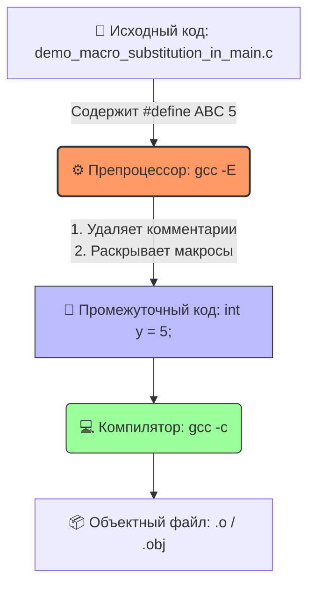

# 🚀 Демонстрация работы препроцессора Си


Данный проект представляет собой наглядный учебный пример, демонстрирующий внутренние механизмы работы препроцессора языка Си. На примере функции `main` показано, как именно обрабатываются директивы `#define` и происходит текстовая подстановка макросов до того, как код попадет в компилятор.

---

## 📊 Схема конвейера сборки (Build Pipeline)

Диаграмма наглядно показывает, на каком этапе работает препроцессор и что именно получает компилятор на вход:



---

## 📌 Ключевые концепции

> ⚠️ **Важное примечание:** 
> Макросы `#define` выполняют **исключительно текстовую замену** на этапе предварительной обработки. Они не имеют типов, не занимают места в оперативной памяти как переменные и не проверяются компилятором на соответствие синтаксису типов данных.

### 🔍 Анатомия процесса трансляции:
1. **Стадия препроцессинга (`gcc -E`):** Препроцессор сканирует исходный код, находит текстовый идентификатор `ABC` и заменяет его на литерал `5` по всему тексту программы.
2. **Стадия компиляции (`gcc -c`):** Компилятор получает «чистый» код без директив `#define`. Слово `ABC` для него больше не существует — переменная `y` сразу инициализируется константой `5`.

---

## 🧠 Пошаговый разбор логики кода

Программа выполняет простейшую арифметическую операцию, разделенную на следующие шаги:

* 🔹 **Шаг 1:** Объявляется локальная переменная `x` и инициализируется значением `2`.
* 🔹 **Шаг 2:** Объявляется локальная переменная `y`, которой присваивается макрос `ABC` (в исходном коде). После развертывания препроцессором строка превращается в `int y = 5;`.
* 🔹 **Шаг 3:** Вычисляется сумма `z = x + y`, что физически эквивалентно сложению `2 + 5`.
* 🔹 **Шаг 4:** Программа возвращает статус завершения компилятору/ОС.

---

## 💻 Сравнение кода: ДО и ПОСЛЕ препроцессора

### 📄 Исходный код (`.c`)
Фрагмент кода, который пишет разработчик в редакторе:

```c
/**
 * @brief Демонстрация работы препроцессора и подстановки макроса в функции main.
 *
 * @details Данная функция служит наглядным учебным примером того, как препроцессор
 * Си обрабатывает директивы `#define` перед реальной компиляцией кода.
 *
 * ### Анатомия процесса:
 * 1. **Стадия препроцессинга:** Препроцессор находит текстовый идентификатор `ABC`
 *    и заменяет его на литерал `5` по всему тексту программы.
 * 2. **Стадия компиляции:** Компилятор уже не видит слова `ABC`. Для него переменная
 *    `y` инициализируется константой `5`.
 *
 * ### Пошаговый разбор логики:
 * - Объявляется переменная `x` со значением `2`.
 * - Объявляется переменная `y`, которой присваивается макрос `ABC` (после развертывания: `5`).
 * - Вычисляется сумма `z = 2 + 5`.
 *
 * ### Результат развертывания макроса (Preprocessed Code):
 * @code{.c}
 * int demo_macro_substitution_in_main(int argc, char **argv)
 * {
 *     int x = 2;
 *     int y = 5; // Идентификатор ABC заменен на число 5
 *
 *     int z = x + y;
 *     return 0;
 * }
 * @endcode
 *
 * @param[in] argc Количество аргументов командной строки.
 * @param[in] argv Массив строк-аргументов командной строки.
 *
 * @return Статус выполнения программы.
 * @retval 0 Успешное завершение демонстрации.
 *
 * @note Макросы `#define` выполняют исключительно текстовую замену и не имеют типов.
 * @see ABC
 */
#define ABC 5

int demo_macro_substitution_in_main(int argc, char **argv)
 *
{
    int x = 2;
    int y = ABC; /**< Здесь препроцессор заменит ABC на 5 */

    int z = x + y;
    return 0;
}

```

### ⚙️ Код после развертывания макроса (Preprocessed Code)
Результат работы препроцессора, который затем передается компилятору:

```c
int demo_macro_substitution_in_main(int argc, char **argv)
 *
{
    int x = 2;
    int y = 5;
    int z = x + y;
    return 0;
}
```

---

## 🛠️ Спецификация функции

### Аргументы функции (`API`)

| Параметр | Направление | Тип | Описание |
| :--- | :---: | :---: | :--- |
| **`argc`** | `[in]` | `int` | Количество аргументов, переданных через командную строку. |
| **`argv`** | `[in]` | `char**` | Массив строк (указателей), содержащий сами аргументы. |

### Возвращаемое значение

* **Тип:** `int`
* **Статус:** 
  * `0` — **Успешное завершение** демонстрации (Константа возврата `0`).

---

## 📐 Как запустить и увидеть препроцессор вживую?

Чтобы самостоятельно сгенерировать промежуточный код и убедиться в работе макроса, выполните в терминале команду:

```bash
gcc -E demo_macro_substitution_in_main.c -o preprocessed_code.i
```
Файл `preprocessed_code.i` будет содержать итоговый код, готовый к компиляции, где вместо `ABC` уже подставлена цифра `5`.

---
📎 **Смотрите также:** `ABC` (Связанные директивы препроцессора в документации Doxygen).
