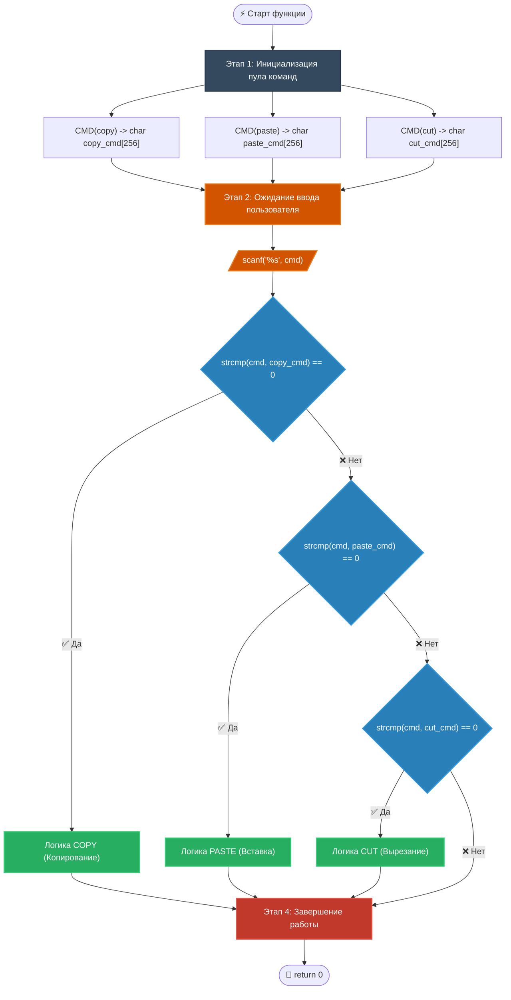

# 🚀 CLI Command Interpreter in C

Интерпретатор командной строки на языке Си с метапрограммированием через макросы препроцессора.

---
---
[ЛАБОРАТОРНАЯ РАБОТА --> ](https://github.com/kolesnikovvitaliy/LERNING_C/tree/main/EXTREME_C/Основные_возможноти_языка/Директивы_препроцессора/Макросы/examples/macro_hash_operators/LAB)
---

## 📌 Обзор проекта

Проект представляет собой минималистичный, быстрый и эффективный парсер консольных команд (`copy`, `paste`, `cut`). Главная особенность архитектуры — **динамическая генерация эталонных строк** во время компиляции с помощью макроса `CMD(NAME)`. Это исключает дублирование кода и снижает вероятность человеческой ошибки при добавлении новых команд.

### Key Features 🌟
* **Препроцессорная магия:** Склеивание токенов (`##`) и превращение их в строки (`#`).
* **Нулевая зависимость:** Используются только стандартные библиотеки Си (`stdio.h`, `string.h`).
* **Модульная структура:** Логика полностью изолирована в функции `execute_command_interpreter`.

---

## 📊 Архитектура и жизненный цикл

Ниже представлена визуальная схема работы интерпретатора — от развертывания макросов в стеке памяти до выполнения каскадного сравнения строк.



---

## 🛠 Глубокий разбор кода

### 1. Генератор команд `CMD(NAME)`
Макрос избавляет от необходимости вручную писать шаблонный код для создания переменных.

```c
#define CMD(NAME) \
    char NAME ## _cmd[256] = ""; \
    strcpy(NAME ## _cmd, #NAME);
```

* **Оператор `##` (Token Pasting):** Склеивает переданное имя с суффиксом `_cmd`. При вызове `CMD(copy)` имя переменной станет `copy_cmd`.
* **Оператор `#` (Stringification):** Оборачивает аргумент в кавычки. Из `copy` получается строковый литерал `"copy"`, который копируется в буфер.

---

### 🔍 Результат развертывания препроцессором (Код "под капотом")

До того как компилятор начнет превращать код в ассемблер и бинарный файл, **препроцессор Си** (первая стадия компиляции) обрабатывает все макросы `#define`, вырезает комментарии и подключает заголовочные файлы.

Вот как выглядит функция `execute_command_interpreter` на самом деле после полной подстановки макросов. Это чистый Си-код, который скрыт от глаз разработчика:

```c
int execute_command_interpreter(void)
{
    /* ========================================================================== */
    /* ЭТАП 1: РАЗВЕРНУТЫЕ МАКРОСЫ И ВЫДЕЛЕНИЕ ПАМЯТИ В СТЕКЕ                      */
    /* ========================================================================== */

    // Препроцессор заменил CMD(copy) на создание массива и копирование имени
    char copy_cmd[256] = "";
    strcpy(copy_cmd, "copy"); // Строковый литерал "copy" подставлен автоматически

    // Препроцессор заменил CMD(paste)
    char paste_cmd[256] = "";
    strcpy(paste_cmd, "paste");

    // Препроцессор заменил CMD(cut)
    char cut_cmd[256] = "";
    strcpy(cut_cmd, "cut");


    /* ========================================================================== */
    /* ЭТАП 2: ЗАХВАТ ПОТОКА ВВОДА                                                */
    /* ========================================================================== */
    char cmd[256];
    scanf("%s", cmd);


    /* ========================================================================== */
    /* ЭТАП 3: КАСКАДНАЯ ДИСПЕТЧЕРИЗАЦИЯ                                          */
    /* ========================================================================== */
    if(strcmp(cmd, copy_cmd) == 0) {
        // Логика копирования
    }
    if(strcmp(cmd, paste_cmd) == 0) {
        // Логика вставки
    }
    if(strcmp(cmd, cut_cmd) == 0) {
        // Логика вырезания
    }

    return 0;
}
```

#### Что изменилось на этапе препроцессинга (Детальный разбор):
1. **Трансформация токенов:** Запись `NAME ## _cmd` стерлась. Вместо нее подставились жесткие имена переменных: `copy_cmd`, `paste_cmd` и `cut_cmd`. Они занимают по 256 байт памяти в стеке функции.
2. **Превращение в строки:** Оператор `#NAME` заменил «голые» слова в коде на настоящие строки в кавычках. Функция `strcpy` принимает их в качестве источника для копирования.
3. **Удаление абстракций:** Компьютер не знает, что такое макрос `CMD`. На этапе компиляции этой абстракции больше нет — осталась только классическая последовательная инициализация массивов.

#### 🛠 Как посмотреть этот код самостоятельно в терминале?
Вы можете заставить компилятор остановиться сразу после работы препроцессора, не создавая исполняемый файл. Для этого используется флаг `-E`.

**Для GCC / Clang (Linux, macOS, MinGW):**
```bash
gcc -E execute_command_interpreter.c -o execute_command_interpreter.c
```
*Откройте файл `preprocessed_main.c`. Прокрутите его в самый низ (после тысяч строк из `stdio.h` и `string.h`), и вы увидите развернутый код своей функции.*

---

### 2. Алгоритм диспетчеризации
Основная функция `execute_command_interpreter` выполняет последовательный разбор:

| Этап | Выполняемая операция | Зона памяти | Безопасность |
| :--- | :--- | :--- | :--- |
| **1. Локальный словарь** | Развертывание макросов `CMD` | Стек (Stack) | Выделено фиксировано по 256 байт на команду |
| **2. Захват потока** | Считывание через `scanf` | Стек (Буфер `cmd`) | ⚠️ **Риск переполнения** при вводе >255 символов |
| **3. Верификация** | Каскад условий `strcmp` | Программный код | O(N) по длине строки |

---

## 🚀 Сборка и запуск

Для компиляции проекта вам понадобится любой компилятор C (GCC, Clang, MSVC).

### Компиляция через GCC:
```bash
gcc -Wall -Wextra -O2 execute_command_interpreter.c -o execute_command_interpreter
```

### Запуск интерактивного режима:
```bash
./execute_command_interpreter
```

### Пример взаимодействия:
```text
\$ ./execute_command_interpreter
copy
[Программа успешно распознала команду copy и завершилась с кодом 0]
```

---

## ⚠️ Предупреждения и векторы улучшения

* **Уязвимость буфера:** Метод `scanf("%s", cmd)` не контролирует размер ввода. Для продакшена замените его на безопасный аналог:
  ```c
  fgets(cmd, sizeof(cmd), stdin);
  cmd[strcspn(cmd, "\n")] = '\0'; // Удаление символа переноса строки
  ```
* **Регистрозависимость:** Команды `COPY` или `Copy` не будут распознаны. Для исправления можно использовать функцию `strcasecmp` (в POSIX системах) вместо `strcmp`.

---
[← Назад](https://github.com/kolesnikovvitaliy/LERNING_C/tree/main/EXTREME_C/Основные_возможноти_языка/Директивы_препроцессора/Макросы/examples)
---

