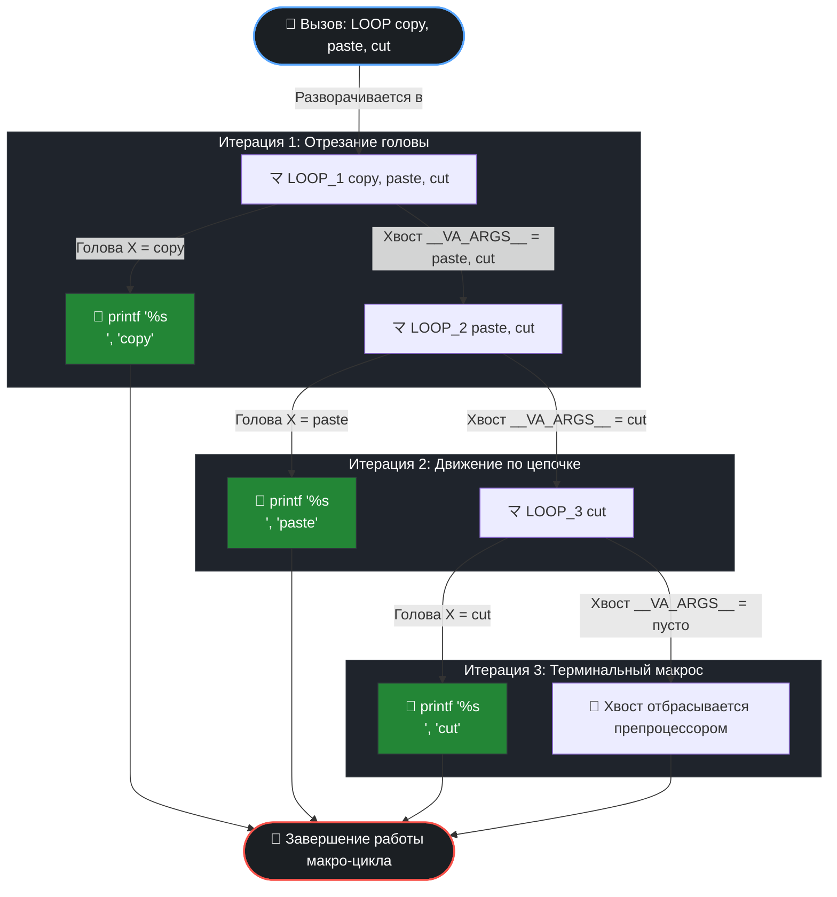

# 🚀 Магия препроцессора Си: Полная имитация цикла на вариативных макросах


Добро пожаловать в мир **метапрограммирования на этапе компиляции**! Этот проект представляет собой глубокое техническое исследование и практическую демонстрацию того, как заставить текстовый препроцессор языка Си (`cpp`) выполнять последовательный обход (**`FOR_EACH`**) списка аргументов переменной длины (`__VA_ARGS__`) без использования ресурсов процессора в рантайме.

---
---
[ЛАБОРАТОРНАЯ РАБОТА --> ](https://github.com/kolesnikovvitaliy/LERNING_C/tree/main/EXTREME_C/Основные_возможноти_языка/Директивы_препроцессора/Макросы/examples/Имитация_цикла_с_помощью_вариативных_макросов/LAB)
---
## 📌 Суть проблемы и архитектурное решение

Препроцессор Си по своей природе **лишен состояния (stateless)** и принципиально **не поддерживает рекурсию** (макрос, вызывающий сам себя, блокируется препроцессором для предотвращения бесконечного зацикливания).

Чтобы обойти это ограничение, применяется техника **каскадного развертывания жестко заданных макросов**. Мы создаем цепочку изолированных обработчиков, где каждый уровень выполняет три действия:
1. **Изолирует** первый (головной) аргумент `X`.
2. **Применяет** к нему целевое действие (в нашем случае — строковое преобразование `#X` и вывод).
3. **Делегирует** оставшийся список аргументов (хвост) следующему макросу в каскаде.

---

## 📊 Визуализация каскадного раскрытия токенов

Ниже представлена детальная схема того, как препроцессор дробит, модифицирует и передает управление по цепочке макросов при вызове `LOOP(copy, paste, cut)`:



---

## 💻 Исходный код эксперимента

Ниже представлен чистый, готовый к компиляции код программы. Каждая строчка снабжена комментариями, объясняющими поведение компилятора.

```c
#include <stdio.h>

/**
 * ============================================================================
 * ВНУТРЕННИЕ МАКРОСЫ КАСКАДА (Реализация итератора)
 * ============================================================================
 */

/**
 * @brief Третий уровень каскада (Финальный триггер).
 * @details Принимает текущий аргумент, превращает его в строку оператором '#'
 * и выводит. Любые аргументы, переданные далее в '...', полностью игнорируются,
 * так как этот макрос является тупиковой веткой каскада.
 */
#define LOOP_3(X, ...) \
    printf("[Итерация 3] Строковый токен: %s\n", #X);

/**
 * @brief Второй уровень каскада.
 * @details Обрабатывает элемент под номером 2 и пробрасывает оставшуюся
 * часть вариативного списка в терминальный макрос LOOP_3.
 */
#define LOOP_2(X, ...) \
    printf("[Итерация 2] Строковый токен: %s\n", #X); \
    LOOP_3(__VA_ARGS__)

/**
 * @brief Первый уровень каскада (Точка инициализации обхода).
 * @details Принимает первый элемент, изолирует его, а всю остальную
 * цепочку аргументов раскрывает внутри макроса LOOP_2.
 */
#define LOOP_1(X, ...) \
    printf("[Итерация 1] Строковый токен: %s\n", #X); \
    LOOP_2(__VA_ARGS__)

/**
 * ============================================================================
 * ПУБЛИЧНЫЙ ИНТЕРФЕЙС
 * ============================================================================
 */

/**
 * @brief Главный интерфейсный макрос-итератор.
 * @details Инкапсулирует вызов внутреннего каскада, скрывая детали
 * реализации от конечного разработчика.
 */
#define LOOP(...) \
    LOOP_1(__VA_ARGS__)

/**
 * ============================================================================
 * ДЕМОНСТРАЦИОННЫЙ СТЕНД
 * ============================================================================
 */
int main(int argc, char **argv) {
    /* Техническое подавление предупреждений компилятора об unused переменных */
    (void)argc;
    (void)argv;

    printf("==================================================\n");
    printf("⚡ ЭКСПЕРИМЕНТ 1: Передача строки без запятых\n");
    printf("==================================================\n");
    /* Ошибка восприятия: Препроцессор видит ОДИН аргумент, так как нет запятых.
     * Весь текст пакуется в строку "co py paste cut", а пустые хвосты дублируются. */
    LOOP(co py paste cut)

    printf("\n==================================================\n");
    printf("⚡ ЭКСПЕРИМЕНТ 2: Идеальное заполнение каскада (N = 3)\n");
    printf("==================================================\n");
    /* Идеальный сценарий: Количество аргументов в точности равно длине каскада.
     * Каждый макрос забирает свой элемент. Вывод чистый и последовательный. */
    LOOP(copy, paste, cut)

    printf("\n==================================================\n");
    printf("⚡ ЭКСПЕРИМЕНТ 3: Переполнение каскада аргументами (N > 3)\n");
    printf("==================================================\n");
    /* Переполнение: Передано 4 аргумента. На шаге LOOP_3 аргумент 'select'
     * попадает в вариативный хвост '...' макроса LOOP_3 и бесследно уничтожается. */
    LOOP(copy, paste, cut, select)

    return 0;
}
```

---

## 🔍 Глубокий разбор аномалий и поведения препроцессора

Для полного понимания механики метапрограммирования, рассмотрим, во что превращается код после фазы препроцессинга (`gcc -E main.c`):

| Сценарий | Передаваемый токен | Что видит препроцессор | Реальный результат вывода на экран | В чем причина? |
| :--- | :--- | :--- | :--- | :--- |
| **🚨 Без разделителей** | `LOOP(co py paste cut)` | `LOOP_1(co py paste cut, )` | `co py paste cut`<br>`co py paste cut`<br>`co py paste cut` | Препроцессор ищет **запятые**. Поскольку их нет, весь кусок текста — это один аргумент `X`. При раскрытии пустые хвосты заставляют макросы дублировать `X`. |
| **🎯 Идеальный баланс** | `LOOP(copy, paste, cut)` | `LOOP_1(copy, paste, cut)` | `copy`<br>`paste`<br>`cut` | Идеальная утилизация. Три аргумента последовательно распределились по трем уровням нашего конвейера. |
| **⚠️ Переполнение** | `LOOP(copy, paste, cut, select)` | `LOOP_1(copy, paste, cut, select)` | `copy`<br>`paste`<br>`cut` | Жесткое ограничение емкости. Токен `select` заходит на 3-й шаг как мусорный аргумент `__VA_ARGS__`, который в теле `LOOP_3` никак не используется. |

---

## 🛠️ Продвинутые трюки: Как делают в продакшене?

Описанный выше базовый каскад слишком жесткий и ограниченный. В реальной промышленной разработке (например, в системных библиотеках Linux Kernel) этот подход автоматизируют, добавляя динамический подсчет аргументов и безопасные операции.

### 1. Трюк сдвига токенов для автоподсчета (`NUM_ARGS`)
Вместо ручного выбора макроса создают специальный препроцессорный счетчик. Он использует сдвиг аргументов вправо на фиксированную позицию:
```c
#define ARGS_COUNT_INTERNAL(_1, _2, _3, _4, N, ...) N
#define NUM_ARGS(...) ARGS_COUNT_INTERNAL(__VA_ARGS__, 4, 3, 2, 1)

// Вызов NUM_ARGS(a, b) вернет 2, так как список сдвинет числа вправо.
```

### 2. Динамическая склейка (Token Pasting)
С помощью оператора склейки `##` препроцессор сам вычисляет, какой макрос вызвать, избегая падений или холостых проходов:
```c
#define CONCAT(a, b) a ## b
#define REAL_LOOP(COUNT, ...) CONCAT(LOOP_, COUNT)(__VA_ARGS__)
#define LOOP(...) REAL_LOOP(NUM_ARGS(__VA_ARGS__), __VA_ARGS__)
```

### 3. Современная директива `__VA_OPT__` (C++20 / C23)
В новых стандартах появился макро-оператор `__VA_OPT__(...)`, который генерирует содержимое внутри скобок только в том случае, если вариативный список `__VA_ARGS__` не пуст. Это позволяет организовать чистую псевдо-рекурсию:
```c
#define LOOP_EACH(X, ...) process(X) __VA_OPT__(LOOP_EACH_INDIRECT(__VA_ARGS__))
#define LOOP_EACH_INDIRECT() LOOP_EACH // Обход блокировки рекурсии
```

---

## 💎 Реальный пример: Автоматическое освобождение ресурсов (`FREE_ALL`)

Применение этой магии на практике — создание безопасного макроса очистки памяти. Данный макрос принимает список указателей любой длины (до 4 элементов), автоматически вычисляет их количество, последовательно вызывает для каждого `free()`, а затем зануляет указатели (`NULL`), защищая программу от опасной уязвимости **Use-After-Free**.

```c
#include <stdio.h>
#include <stdlib.h>

/* Механизм подсчета аргументов (до 4-х элементов) */
#define _FREE_COUNT_INTERNAL(_1, _2, _3, _4, N, ...) N
#define FREE_ARGS_COUNT(...) _FREE_COUNT_INTERNAL(VA_ARGS, 4, 3, 2, 1, 0)
/* Операция склейки токенов */
#define _FREE_CONCAT_INTERNAL(A, B) A ## B
#define _FREE_CONCAT(A, B) _FREE_CONCAT_INTERNAL(A, B)
/* Безопасное атомарное действие над одним указателем */
#define SAFE_FREE(ptr) do { free(ptr); (ptr) = NULL; } while(0)
/* Реализация конвейера освобождения памяти */
#define FREE_ALL_1(X)      SAFE_FREE(X);
#define FREE_ALL_2(X, ...) SAFE_FREE(X); FREE_ALL_1(VA_ARGS)
#define FREE_ALL_3(X, ...) SAFE_FREE(X); FREE_ALL_2(VA_ARGS)
#define FREE_ALL_4(X, ...) SAFE_FREE(X); FREE_ALL_3(VA_ARGS)
/* Универсальный публичный макрос-интерфейс */
#define FREE_ALL(...) FREE_CONCAT(FREE_ALL, FREE_ARGS_COUNT(VA_ARGS))(VA_ARGS)
int main(void)
{
// Выделение памяти под разнотипные ресурсы
int *a = (int *)malloc(sizeof(int));
double *b = (double *)malloc(sizeof(double));
char *c = (char *)malloc(50 * sizeof(char));
if (!a || !b || !c) {return 1;}
printf("До очистки:   a = %p, b = %p, c = %p\n", (void*)a, (void*)b, (void*)c);
// Магия: Очищаем и зануляем три указателя одной строкой кода!
FREE_ALL(a, b, c);
printf("После очистки: a = %p, b = %p, c = %p\n", (void*)a, (void*)b, (void*)c);
// На экране отобразятся три нулевых адреса (nil / 0x0)
return 0;
}
```

---
[← Назад](https://github.com/kolesnikovvitaliy/LERNING_C/tree/main/EXTREME_C/Основные_возможноти_языка/Директивы_препроцессора/Макросы/examples)
---
