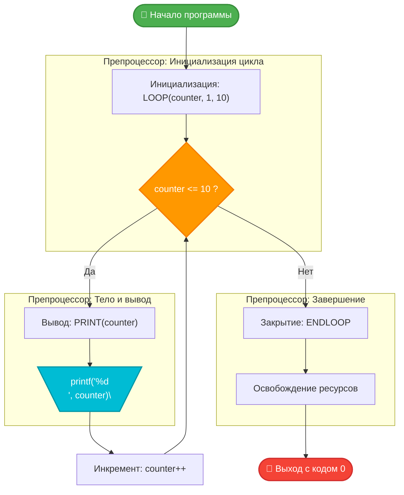

# 🚀 Custom Syntax Loop Demonstrator

Ниже представлено подробное техническое руководство по проекту метапрограммирования на языке Си, который демонстрирует трансформацию стандартного императивного синтаксиса в декларативный стиль с помощью возможностей макропроцессора.

---
---
[ЛАБОРАТОРНАЯ РАБОТА --> ](https://github.com/kolesnikovvitaliy/LERNING_C/tree/main/EXTREME_C/Основные_возможноти_языка/Директивы_препроцессора/Макросы/examples/Использование_макросов_для_генерации_цикла/LAB)
---

## 📌 Обзор проекта

Данный проект иллюстрирует абстракцию управляющих конструкций языка Си. С помощью кастомных макросов `LOOP`, `PRINT` и `ENDLOOP` привычный синтаксис циклов превращается в высокоуровневую кодовую базу, напоминающую синтаксис языков Basic или Pascal, сохраняя при этом производительность компилируемого Си-кода.

### 🎯 Ключевые особенности
* **Инкапсуляция логики**: Полная изоляция управляющих переменных внутри итератора.
* **Безопасность типов**: Направленная работа с целочисленными диапазонами данных (`int`).
* **Чистый синтаксис**: Избавление от рутинного написания спецификаторов формата (`%d\n`) и фигурных скобок.

---

## 🗺️ Архитектура и поток управления

Диаграмма ниже наглядно иллюстрирует, как разворачиваются синтаксические макросы во время фазы препроцессинга и как именно выполняется функция `generate_macro_loop` (`main`):



---

## 🛠️ Спецификация API (Макросы и функции)

### 1. Синтаксические макросы

| Макрос | Сигнатура / Развертывание | Описание |
| :--- | :--- | :--- |
| **`PRINT(a)`** | `printf("%d\n", a);` | Мгновенно печатает целое число в консоль с автоматическим переносом строки. |
| **`LOOP(v, s, e)`** | `for (int v = s; v <= e; v++) {` | Объявляет изолированный счетчик `v` от начального значения `s` до конечного `e`. |
| **`ENDLOOP`** | `}` | Безопасно закрывает область видимости и завершает итерационный блок. |

### 2. Главная функция управления
* **Имя функции**: `main` (Логическое имя: `generate_macro_loop`)
* **Назначение**: Координация и последовательный запуск инкрементирующего подсчета в заданном линейном диапазоне от 1 до 10 включительно.
* **Параметры**:
  * `args` (`int`): Количество аргументов командной строки.
  * `argv` (`char**`): Массив указателей на строки аргументов.
* **Результат работы**: Возвращает `0` при успешном завершении всех итераций.

---

---

## 💻 Исходный код и развертывание макросов

Ниже представлен исходный код программы со встроенной документацией **Doxygen**, а также результат работы препроцессора, который показывает, во что превращаются макросы непосредственно перед компиляцией.

### 1. Исходный код (Исходный синтаксис)
<details>
<summary>📂 Посмотреть generate_macro_loop.c со спецификацией Doxygen</summary>

```c
/**
 * @file generate_macro_loop.c
 * @brief Программа демонстрации работы макросов итерации и вывода.
 */

#include <stdio.h>

/**
 * @def PRINT(a)
 * @brief Макрос для мгновенного вывода целочисленного значения.
 * @param a Целочисленная переменная или константа (тип int).
 */
#define PRINT(a) printf("%d\n", a);

/**
 * @def LOOP(v, s, e)
 * @brief Макрос инициализации структурированного цикла со строгим шагом.
 * @param v Имя создаваемой управляющей переменной (счетчика).
 * @param s Начальное пороговое значение (инклюзивное).
 * @param e Конечное пороговое значение (инклюзивное).
 */
#define LOOP(v, s, e) for (int v = s; v <= e; v++) {

/**
 * @def ENDLOOP
 * @brief Макрос безопасного закрытия логического блока.
 */
#define ENDLOOP }

/**
 * @brief execute_linear_range_counter — Главная управляющая функция программы.
 */
int main(int args, char **argv) {

    LOOP(counter, 1, 10)
        PRINT(counter)
    ENDLOOP

    return 0;
}
```
</details>

### 2. Чистый Си-код (После развертывания препроцессором)

После того как препроцессор обработает заголовочные файлы и подставит значения всех макросов (эквивалентно вызову команды `gcc -E generate_macro_loop.c`), функция `main` принимает классический вид стандартного языка Си:

```c
// [Внутреннее содержимое stdio.h, включая объявление функции printf]

int main(int args, char **argv) {

    for (int counter = 1; counter <= 10; counter++) {
        printf("%d\n", counter);
    }

    return 0;
}
```

> ⚠️ **Важно**: Обратите внимание, что переменная `counter` создается прямо внутри выражения `for`. Это означает, что её область видимости ограничена данным циклом, и она автоматически уничтожится после выполнения макроса `ENDLOOP`.

---

---

## ⚡ Быстрый старт и запуск

### Требования
Для сборки и запуска проекта вам понадобится компилятор **GCC** или **Clang**.

### Сборка и выполнение одной командой:
```bash
gcc generate_macro_loop.c -o generate_macro_loop && ./generate_macro_loop
```

### Ожидаемый вывод в терминале:
```text
1
2
3
4
5
6
7
8
9
10
```
---
[← Назад](https://github.com/kolesnikovvitaliy/LERNING_C/tree/main/EXTREME_C/Основные_возможноти_языка/Директивы_препроцессора/Макросы/examples)
---
