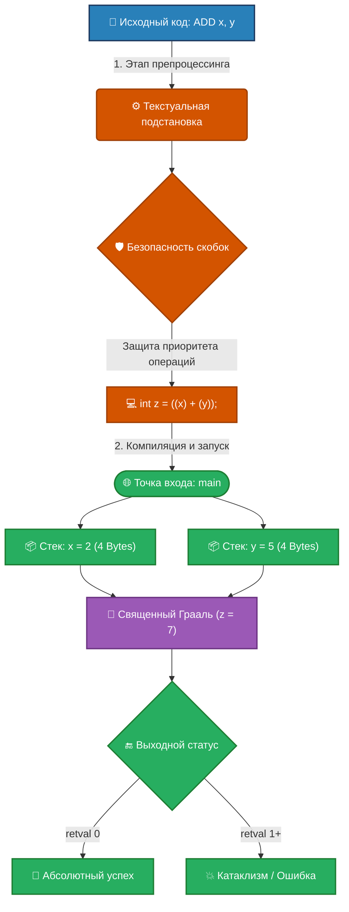

# 🚀 MacroMagic C-Demo: Монументальное Сложение


---

### 📝 Описание проекта
**`demo_macro_substitution_in_main.c`** — это роскошный демонстрационный модуль, воспевающий классическую микромагию препроцессора Си. Файл представляет собой фундаментальный пример использования макроопределений и базовой арифметики. Каждая строчка кода снабжена монументальным описанием для автоматической генерации документации.

---

## 🗺️ Архитектура и жизненный цикл (Mermaid Схема)

Визуализация этапов компиляции, развертывания макроса в стеке и получения итогового математического триумфа:



---

## ✨ Ключевые Анатомические Элементы

### 🔢 Макрос-Калькулятор `ADD(a, b)`
Высокоскоростной макрос для бинарного сложения, выполняющий текстуальную подстановку на этапе препроцессинга.

* **🧱 Приоритет операций:** Все аргументы и само выражение бережно заключены в круглые скобки `((a) + (b))`. Это гарантирует незыблемость логики даже при передаче сложных выражений вроде `ADD(x & y, z)`.
* **⚠️ Отсутствие проверки типов:** В отличие от стандартных функций, макрос полностью игнорирует типы данных. Допустимо передавать целые числа, числа с плавающей точкой или указатели. **Требуется осторожность!**

### 🎼 Оркестровая сцена `main()`
Центральная точка входа в жизненный цикл программы. Производит инициализацию переменных в пространстве операционной системы:
1. **Переменная `x`:** Фундамент вычисления, инициализированный строгим значением `2`. Занимает стандартные 4 байта памяти.
2. **Переменная `y`:** Призвана дополнить первое число, намертво связана с константой `5` в стеке.
3. **Переменная `z`:** Принимает результат сложения. На этапе компиляции строка превращается в `int z = ((x) + (y));`, рождая число `7`.

### 🔬 Результат развертывания макроса (Вывод препроцессора)
При запуске препроцессора (команда `gcc -E`) все комментарии Doxygen убираются, заголовочные файлы раскрываются, а сам макрос `ADD(x, y)` полностью исчезает, оставляя чистый Си-код:

```c
// [...] Здесь находятся тысячи строк развернутого файла stdio.h

int main(int argc, char **argv) {

    int x = 2;

    int y = 5;

    int z = ((x) + (y)); // <--- Результат триумфальной текстовой подстановки!

    return 0;
}
```

---

## 🛠️ Технологический Стек

| Компонент | Инструмент / Технология | Назначение |
| :--- | :--- | :--- |
| **Язык** | `Си (C99/C11)` | Ядро вычислений и микромагия |
| **Компилятор** | `GCC` / `Clang` | Препроцессинг и сборка |
| **Документация**| `Doxygen` | Монументальная автогенерация |

---

## 🚀 Быстрый старт и компиляция

### Требования
* Компилятор `gcc` или `clang`.
* Утилита `make` (опционально).

### Сборка одной командой
Вы можете скомпилировать данный шедевр с помощью стандартного CLI:

```bash
gcc -Wall -O2 demo_macro_substitution_in_main.c -o macro_demo
```

### Посмотреть результат работы препроцессора (до компиляции):
Чтобы лично увидеть, как макрос превращается в классическое сложение, выполните команду раскрытия макросов:
```bash
gcc -E demo_macro_substitution_in_main.c | grep -A 5 "main"
```

---

## 📊 Документирование (Doxygen)

Весь код снабжен тегами для автоматической генерации документации. Чтобы развернуть монументальный HTML-портал по этому коду:

1. Сгенерируйте конфигурационный файл: `doxygen -g`
2. Запустите генерацию: `doxygen Doxyfile`
3. Откройте файл `html/index.html` в вашем браузере.

---

## 📄 Возвращаемые значения (Exit Codes)

* `0` — **Абсолютный успех**. Программа отработала безукоризненно, все числа сложились корректно.
* `1+` — Код ошибки, сигнализирующий о непредвиденных катаклизмах (в данном сценарии полностью исключено).
