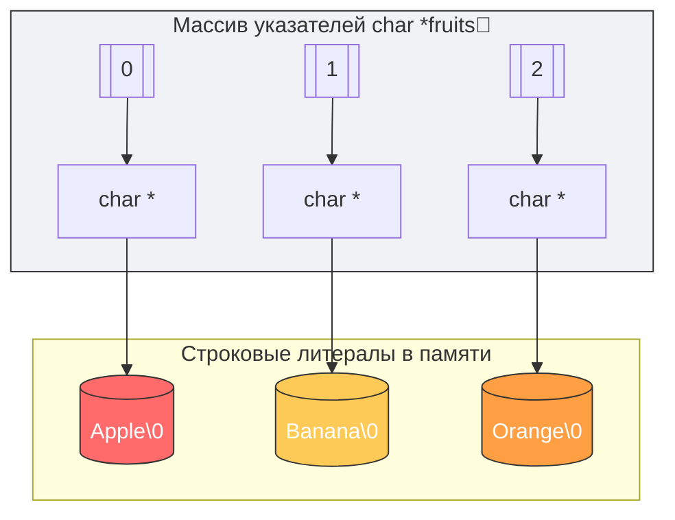

# 📑 ЛАБОРАТОРНАЯ РАБОТА: Охота на «диких» зверей в памяти C

> 🎯 **Цель задания:** Научиться находить, диагностировать с помощью `Valgrind` и исправлять критические ошибки при работе с указателями.
> ⏱️ **Ориентировочное время выполнения:** 30–40 минут.

---

## 🛠️ Задание 1: «Сломанный калькулятор» (Базовый уровень)

Ниже представлен код программы, которая должна возводить число в квадрат через указатель. Однако при запуске она завершается аварийно (`Segmentation fault`).

### ❌ Исходный код с ошибкой:
```c
#include <stdio.h>

void square_number(int *ptr) {
    *ptr = (*ptr) * (*ptr);
}

int main() {
    int *p_num; // Переменная-указатель

    square_number(p_num);

    printf("Результат: %d\n", *p_num);
    return 0;
}
```

### 📋 Ваша задача:
1. Найдите, почему программа падает (какой тип указателя здесь используется?).
2. Исправьте код в вашем редакторе так, чтобы он выводил квадрат числа `5`.

<details>
<summary><b>✅ Посмотреть правильное решение и разбор ошибки</b></summary>
<br>

**Ошибка:** Используется **дикий указатель (Wild Pointer)**. Мы объявили `int *p_num;`, но не выделили под него память и не связали с существующей переменной. Он указывает на случайный мусор в памяти.

**Исправленный код:**
```c
#include <stdio.h>

void square_number(int *ptr) {
    if (ptr != NULL) { // Хорошая практика: проверка на NULL
        *ptr = (*ptr) * (*ptr);
    }
}

int main() {
    int num = 5;       // Создаем реальную переменную на стеке
    int *p_num = &num; // Инициализируем указатель адресом переменной num

    square_number(p_num);

    printf("Результат: %d\n", *p_num); // Выведет: 25
    return 0;
}
```
</details>

---

## 🧪 Задание 2: «Тайный шпион в куче» (Продвинутый уровень)

Этот код успешно компилируется и даже иногда выдает правильный результат. Но утилита `Valgrind` бьет тревогу.

### ❌ Исходный код с ошибкой:
```c
#include <stdio.h>
#include <stdlib.h>

int* create_user_id() {
    int *id = (int*)malloc(sizeof(int));
    if (id == NULL) return NULL;

    *id = 2026;
    return id;
}

int main() {
    int *user_id = create_user_id();

    if (user_id != NULL) {
        printf("👤 ID Пользователя: %d\n", *user_id);
    }

    return 0;
}
```
---
---

## 🎭 Массивы строк в C (Массивы указателей `char *arr[]`)

В языке C нет встроенного типа данных `string`. Строка — это просто массив символов, заканчивающийся нулевым байтом (`\0`), то есть `char*`.
Когда нам нужен массив строк (например, список имен или аргументов командной строки), мы создаем **массив указателей**.



### 💻 Пример: Работа со списком строк

```c
#include <stdio.h>

int main() {
    // Массив из 3-х указателей на символы
    char *movies[] = {
        "Matrix",
        "Inception",
        "Interstellar"
    };

    int count = sizeof(movies) / sizeof(movies[0]);

    printf("🎬 Список фильмов:\n");
    for (int i = 0; i < count; i++) {
        // %s ожидает указатель на начало строки (char*)
        printf("%d. %s (Адрес в памяти: %p)\n", i + 1, movies[i], (void*)movies[i]);
    }

    // Изменение указателя: теперь второй элемент смотрит на другую строку
    movies[1] = "The Dark Knight";
    printf("\n🔄 Обновленный фильм №2: %s\n", movies[1]);

    return 0;
}
```

---

## 🔒 Шпаргалка: Константные указатели (`const`)

Модификатор `const` может стоять в разных местах при объявлении указателя, и это кардинально меняет логику работы программы. Существует простое мнемоническое правило: **читайте объявление справа налево**.

| Синтаксис | Как читать? | Что ЗАБЛОКИРОВАНО? | Что РАЗРЕШЕНО? |
| :--- | :--- | :---: | :---: |
| `const int *p` | *p — это указатель на константный int* | Изменение **значения** (`*p = 20;` ❌) | Изменение **адреса** (`p = &other;` 🟢) |
| `int * const p` | *p — это константный указатель на int* | Изменение **адреса** (`p = &other;` ❌) | Изменение **значения** (`*p = 20;` 🟢) |
| `const int * const p` | *p — константный указатель на константный int* | **Всё заблокировано** ❌ | Ничего нельзя менять 🔒 |

### 🔍 Разбор на живых примерах кода:

#### 1. Указатель на константные данные (`const int *p`)
Используется, когда мы хотим защитить исходные данные от случайного изменения (например, при передаче большой структуры в функцию).
```c
int x = 10;
int y = 20;
const int *p = &x; // Данные константны, указатель — нет.

*p = 50;  // ❌ ОШИБКА КОМПИЛЯЦИИ! Данные менять нельзя.
p = &y;   // 🟢 УСПЕШНО! Теперь указатель смотрит на переменную y.
```

#### 2. Константный указатель (`int * const p`)
Сам указатель становится «намертво» привязан к одной ячейке памяти, но данные внутри этой ячейки можно перезаписывать.
```c
int x = 10;
int y = 20;
int * const p = &x; // Указатель константен, данные — нет.

*p = 50;  // 🟢 УСПЕШНО! Значение x теперь равно 50.
p = &y;   // ❌ ОШИБКА КОМПИЛЯЦИИ! Нельзя перенаправить указатель на другой адрес.
```
---

### 📋 Ваша задача:
1. Скомпилируйте этот код с флагом `-g`.
2. Запустите его через `valgrind --leak-check=full ./program`.
3. Какую ошибку зафиксировал Valgrind? Исправьте её.

<details>
<summary><b>✅ Посмотреть правильное решение и разбор ошибки</b></summary>
<br>

**Ошибка:** **Утечка памяти (Memory Leak)**. Память была успешно выделена в куче внутри функции `create_user_id` через `malloc()`, но программист забыл освободить её перед завершением работы программы в `main()`. Valgrind покажет `definitely lost` в финальном отчете.

**Исправленный код:**
```c
#include <stdio.h>
#include <stdlib.h>

int* create_user_id() {
    int *id = (int*)malloc(sizeof(int));
    if (id == NULL) return NULL;

    *id = 2026;
    return id;
}

int main() {
    int *user_id = create_user_id();

    if (user_id != NULL) {
        printf("👤 ID Пользователя: %d\n", *user_id);

        // --- ИСПРАВЛЕНИЕ ---
        free(user_id);     // Освобождаем выделенную память!
        user_id = NULL;    // Зануляем указатель, чтобы избежать Dangling Pointer
        // -------------------
    }

    return 0;
}
```
</details>

---

## 🏆 Чек-лист для самопроверки (Критерии приемки)

Перед тем как сдавать работу преподавателю или делать `git push`, убедитесь, что ваш код соответствует стандартам безопасного программирования на C:

- [ ] ◽ Ни один указатель в программе не остался неинициализированным (`= NULL` или `= &var`).
- [ ] ◽ Перед каждым разыменованием указателя, пришедшего извне, стоит проверка `if (ptr != NULL)`.
- [ ] ◽ Программа компилируется без предупреждений (флаги `-Wall -Wextra`).
- [ ] ◽ Отчет `Valgrind` содержит заветную строку:
  `All heap blocks were freed -- no leaks are possible`.

---
🚀 *Удачи в отладке! Помните: настоящий программист на C видит память насквозь.*

---
[← Назад](https://github.com/kolesnikovvitaliy/LERNING_C/tree/main/EXTREME_C/Основные_возможноти_языка/Указатели_на_переменные)
---
