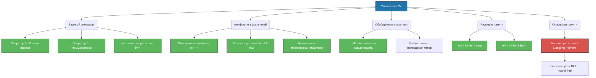

# 🚀 Работа с указателями в языке Си: От синтаксиса до архитектуры

Добро пожаловать в полное руководство по работе с указателями! В языке Си указатели — это фундамент управления памятью. Они обеспечивают максимальную скорость работы приложений и прямой доступ к аппаратным ресурсам, но требуют высокой дисциплины программирования.

---

## 🗺️ Общая карта концепций памяти
Следующая схема наглядно показывает, как взаимосвязаны различные аспекты работы с указателями: синтаксис, типы, размеры и потенциальные опасности.


---

## 📌 Оглавление
- [📊 Указатели_на_переменные](https://github.com/kolesnikovvitaliy/LERNING_C/tree/main/EXTREME_C/Основные_возможноти_языка/Указатели_на_переменные)
- [📊 Синтаксис](https://github.com/kolesnikovvitaliy/LERNING_C/tree/main/EXTREME_C/Основные_возможноти_языка/Синтаксис)
- [💻 Размер_указателей](https://github.com/kolesnikovvitaliy/LERNING_C/tree/main/EXTREME_C/Основные_возможноти_языка/Размер_указателей)
- [⚙️ Обобщенные_указатели](https://github.com/kolesnikovvitaliy/LERNING_C/tree/main/EXTREME_C/Основные_возможноти_языка/Обобщенные_указатели)
- [🖥️ Арифметические_операции_указателями_на_переменные](https://github.com/kolesnikovvitaliy/LERNING_C/tree/main/EXTREME_C/Основные_возможноти_языка/Арифметические_операции_указателями_на_переменные)
- [🛠️ Висячие_указатели](https://github.com/kolesnikovvitaliy/LERNING_C/tree/main/EXTREME_C/Основные_возможноти_языка/Висячие_указатели)

---

## 📌 1. Базовый синтаксис и указатели на указатели (Syntax & Pointer-to-Pointer)

Указатель — это переменная, значением которой является адрес другой переменной в памяти.
*   `&` (оператор взятия адреса) — возвращает адрес переменной.
*   `*` (оператор разыменования) — позволяет получить или изменить значение, лежащее по адресу.

### Концепция `int**` (Указатель на указатель)
Указатель сам по себе является переменной в памяти, а значит, он тоже обладает адресом. Мы можем создать второй указатель, который будет хранить адрес первого.

```c
#include <stdio.h>

int main() {
    int value = 42;
    int *ptr = &value;   // Одинарный указатель: хранит адрес переменной value
    int **dptr = &ptr;   // Двойной указатель: хранит адрес указателя ptr

    // Визуализация связей:
    // [dptr] -> [ptr] -> [value (42)]

    printf("Адрес ptr: %p\n", (void*)dptr);
    printf("Адрес value (через ptr): %p\n", (void*)*dptr);
    printf("Значение value (двойное разыменование): %d\n", **dptr); // Выведет 42
    return 0;
}
```

---

## ⚔️ Разбор: Указатель на массив `int(*)[3]` vs Массив указателей `int*[3]`

Из-за правил приоритета операторов в Си эти две записи создают принципиально разные структуры данных.

### 1. `int *arr[3]` — Массив указателей (Array of Pointers)
*   **Что это:** Обычный статический массив из 3 элементов.
*   **Тип элементов:** Каждый элемент этого массива является указателем на `int` (`int*`).
*   **Память:** Выделяется память под 3 адреса. Каждый адрес может вести на независимую переменную или на разные массивы.

```c
int a = 10, b = 20, c = 30;
int *arr[3] = {&a, &b, &c}; // Массив, хранящий адреса

printf("%d\n", *arr[1]); // Выведет 20 (разыменовали второй указатель в массиве)
```

### 2. `int (*ptr)[3]` — Указатель на статический массив (Pointer to Array)
*   **Что это:** Один-единственный указатель.
*   **На что указывает:** Он указывает на целый статический массив из 3 элементов типа `int`.
*   **Память:** Выделяется память только под один адрес (размер указателя). При операции `ptr + 1` смещение в памяти произойдет сразу на `3 * sizeof(int)` байт.

```c
int grid[2][3] = {{1, 2, 3}, {4, 5, 6}};
int (*ptr)[3] = grid; // ptr указывает на первую строку (массив из 3 элементов)

ptr++; // Переместились на вторую строку!
printf("%d\n", (*ptr)[0]); // Выведет 4 (первый элемент второй строки)
```

---

## 🧮 2. Арифметические операции и многомерные массивы

Арифметика указателей измеряется не в байтах, а в **размерах типов данных**, на которые они указывают.

### Арифметика в многомерных массивах
В Си двумерный статический массив `int arr[2][3]` гарантированно расположен в памяти **одним непрерывным блоком** (строка за строкой).

```c
int arr[2][3] = {
    {10, 20, 30},
    {40, 50, 60}
};

// arr + 1 смещает указатель сразу на ЦЕЛУЮ СТРОКУ (3 элемента int = 12 байт)
int *secondRow = *(arr + 1); // Указывает на начало второй строки (на элемент 40)

// Получение значения 60 (строка 1, индекс 2) через арифметику указателей:
int value = *( *(arr + 1) + 2 );
printf("%d\n", value); // Выведет 60
```

---

## 🏗️ 3. Динамическое выделение матрицы через `int**`

В отличие от статических массивов, динамическая матрица через `int**` не является непрерывной в памяти. Это массив указателей, каждый из которых ссылается на свой независимый выделенный кусок памяти (`malloc`).

```c
#include <stdio.h>
#include <stdlib.h>

int main() {
    int rows = 3;
    int cols = 4;

    // 1. ВЫДЕЛЕНИЕ ПАМЯТИ
    // Выделяем память под массив указателей на строки
    int **matrix = (int**)malloc(rows * sizeof(int*));
    for (int i = 0; i < rows; ++i) {
        matrix[i] = (int*)malloc(cols * sizeof(int)); // Выделяем память под каждую строку
    }

    // 2. НАПОЛНЕНИЕ ДАННЫМИ
    int counter = 1;
    for (int i = 0; i < rows; ++i) {
        for (int j = 0; j < cols; ++j) {
            matrix[i][j] = counter++;
        }
    }

    // Вывод элемента для проверки
    printf("Элемент [1][2]: %d\n", matrix[1][2]); // Выведет 7

    // 3. ПРАВИЛЬНОЕ ОЧИЩЕНИЕ ПАМЯТИ (Защита от утечек и висячих указателей)
    for (int i = 0; i < rows; ++i) {
        free(matrix[i]); // Сначала освобождаем каждую строку
    }
    free(matrix);        // Затем освобождаем массив указателей
    matrix = NULL;       // Зануляем, чтобы избежать dangling pointer

    return 0;
}
```

---

## 🌐 4. Обобщенные указатели (Generic Pointers)

Указатель типа `void*` называют "указателем на сырую память". Он может хранить адрес любого типа. Перед разыменованием его необходимо явно привести к нужному типу данных.

```c
int number = 42;
void *genericPtr = &number;
int *intPtr = (int*)genericPtr; // Явное приведение типов в стиле Си
printf("%d\n", *intPtr); // Выведет 42
```

---

## 📏 5. Размер указателей (Pointer Size)

Размер указателя всегда зависит только от архитектуры процессора и операционной системы, а не от типа, на который он ссылается.

| Архитектура системы | Размер любого указателя (`int*`, `int**`, `void*`) |
| :--- | :--- |
| **x86 (32-разрядная)** | **4 байта** |
| **x64 (64-разрядная)** | **8 байт** |

---

## ⚠️ 6. Висячие указатели (Dangling Pointers)

Это указатели, хранящие адреса уже освобожденной памяти. Всегда зануляйте указатели (`ptr = NULL;`) сразу после вызова функции `free()`.

---

## 🧠 7. Практический блок для самопроверки

Попробуйте решить задачи самостоятельно, не подглядывая в ответы!

### Вопросы и задачи

1. **Задача на размер**: Какой объем памяти на 64-битной системе займет переменная `int *arr[5]`?
2. **Задача на арифметику**: Дан массив `int data[] = {11, 22, 33, 44}; int *p = data;`. Что выведет команда `printf("%d", *(p + 2));`?
3. **Найдите ошибку**: Что не так с этим кодом?
   ```c
   int *p = (int*)malloc(sizeof(int));
   *p = 5;
   free(p);
   printf("%d\n", *p);
   ```
4. **Задача на `int**`**: Дан код:
   ```c
   int x = 5;
   int *p = &x;
   int **pp = &p;
   **pp = 10;
   ```
   Чему теперь равно значение переменной `x`?

<details>
<summary>🔑 Нажмите, чтобы посмотреть ответы с объяснениями</summary>

### Ответы

1. **Ответ: 40 байт.**
   *Объяснение:* `int *arr[5]` — это массив из 5 указателей. Поскольку система 64-битная, каждый указатель занимает 8 байт. Итого: $5 \times 8 = 40$ байт.
2. **Ответ: 33.**
   *Объяснение:* `p` указывает на первый элемент (индекс 0, значение 11). Операция `p + 2` смещает указатель на 2 элемента вперед (на индекс 2, к числу 33). Разыменование `*` считывает это значение.
3. **Ответ: Использование висячего указателя (Dangling Pointer).**
   *Объяснение:* После вызова `free(p)` память возвращается операционной системе. Попытка прочитать данные через `*p` на следующей строке вызывает неопределенное поведение (Undefined Behavior). Нужно было занулить указатель: `p = NULL;`.
4. **Ответ: 10.**
   *Объяснение:* Выражение `**pp` производит двойное разыменование. Сначала переходит по адресу `pp` к указателю `p`, а затем по адресу `p` к самой переменной `x` и перезаписывает её значение.

</details>

---
💡 *Совет: Пишите безопасный код на Си — всегда проверяйте результат `malloc` на равенство `NULL` перед использованием памяти!*

---
[← Назад](https://github.com/kolesnikovvitaliy/LERNING_C/tree/main/EXTREME_C/Основные_возможноти_языка/)
---
