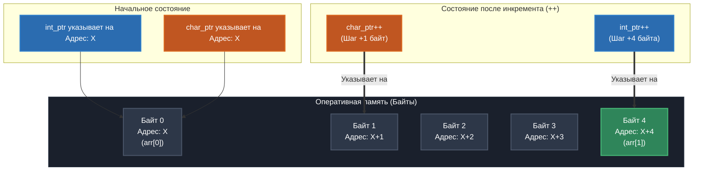

# 🧮 Арифметика указателей в языке Си
## В РАЗАРАБОТКЕ
Добро пожаловать в интерактивный учебный модуль, посвященный **арифметическим операциям над указателями**. В отличие от обычных переменных, математика указателей напрямую привязана к архитектуре памяти компьютера и размеру типов данных.

---
---
[ЛАБОРАТОРНАЯ РАБОТА --> ](https://github.com/kolesnikovvitaliy/LERNING_C/tree/main/EXTREME_C/Указатели_на_переменные/Арифметические_операции_указателями_на_переменные/LAB)
---

## 📌 Оглавление
1. [🔬 Теоретический минимум](#-теоретический-минимум)
2. [🔗 Связь массивов и указателей (`arr[i]` vs `*(arr + i)`)](#-связь-массивов-и-указателей-arri-vs-arr--i)
3. [💻 Демонстрационный код (`pointer_math.c`)](#-демонстрационный-код-pointer_mathc)
4. [📊 Визуализация смещения в памяти (Mermaid)](#-визуализация-смещения-в-памяти-mermaid)
5. [🛠 Пошаговый разбор арифметики](#-пошаговый-разбор-арифметики)
6. [🧠 Интерактивный квиз](#-интерактивный-квиз)
7. [🛑 Безопасность: Выход за границы буфера (Buffer Overflow)](#-безопасность-выход-за-границы-буфера-buffer-overflow)
8. [🚀 Компиляция и запуск](#-компиляция-и-запуск)
9. [🔬 -->  Длина арифметического шага для двух указателей](https://github.com/kolesnikovvitaliy/LERNING_C/tree/main/EXTREME_C/Указатели_на_переменные/Арифметические_операции_указателями_на_переменные/Длина_арифметического_шага_для_двух_указателей/)
10. [🔬 -->  Перебор_элементов_массива_без_арифметики_указателей](https://github.com/kolesnikovvitaliy/LERNING_C/tree/main/EXTREME_C/Указатели_на_переменные/Арифметические_операции_указателями_на_переменные/Перебор_элементов_массива_без_арифметики_указателей/)
11. [🔬 -->  Перебор_элементов_массива_с_помощью_арифметики_указателей](https://github.com/kolesnikovvitaliy/LERNING_C/tree/main/EXTREME_C/Указатели_на_переменные/Арифметические_операции_указателями_на_переменные/Перебор_элементов_массива_с_помощью_арифметики_указателей/)

---

## 🔬 Теоретический минимум

Когда мы прибавляем единицу к обычному числу, мы получаем `число + 1`. Но когда мы прибавляем единицу к указателю (`ptr++` или `ptr + 1`), адрес увеличивается на **размер типа данных**, на который этот указатель ссылается.

> 💡 **Формула смещения адреса:**
> $$\text{Новый адрес} = \text{Старый адрес} + (n \times \text{sizeof(тип)})$$
> где $n$ — число, на которое мы сдвигаем указатель.

### Основные правила:
* **Разрешено:** Сложение указателя с целым числом, вычитание целого числа из указателя, а также вычитание двух указателей одного типа (чтобы узнать расстояние между ними).
* **Запрещено:** Сложение двух указателей (сложение адресов `0x1000 + 0x2000` не имеет логического смысла), умножение и деление указателей.

---

## 🔗 Связь массивов и указателей (`arr[i]` vs `*(arr + i)`)

В языке Си имя массива без индексов является **указателем на его первый элемент** (на элемент с индексом `0`). Из этого факта вытекает фундаментальное правило: квадратные скобки `[]` — это просто красивый «синтаксический сахар».

Каждый раз, когда вы пишете `arr[i]`, компилятор Си за кулисами превращает это выражение в арифметику указателей:
$$\text{arr}[i] \equiv *(\text{arr} + i)$$

### 😮 Забавный факт (Магия Си)
Так как операция сложения коммутативна ($a + b = b + a$), выражение `*(arr + i)` абсолютно идентично выражению `*(i + arr)`.
Это означает, что следующий код на Си является **полностью валидным**:
```c
int array[5] = {10, 20, 30, 40, 50};
printf("%d", 2[array]); // Выведет 30!
```
*Никогда не используйте это в продакшене, чтобы не свести с ума коллег, но знайте: для компилятора `2[array]` превращается в `*(2 + array)`, что дает элемент с индексом 2.*

---

## 💻 Демонстрационный код (`pointer_math.c`)

Ниже представлен пошаговый пример, демонстрирующий, как ведут себя указатели типов `int*` и `char*` при инкременте, а также эквивалентность обращения по индексу и через разыменование.

```c
#include <stdio.h>

int main(int argc, char **argv)
{
    // Подавляем варнинги о неиспользуемых аргументах
    (void)argc; (void)argv;

    // Создаем массив и указатели разных типов на его начало
    int arr[3] = {10, 20, 30};

    int *int_ptr = arr;           // Равносильно &arr[0]
    char *char_ptr = (char*)arr;  // Принудительно приводим к байтовому указателю

    printf("--- 1. Начальное состояние ---\n");
    printf("Размер int: %zu байта, размер char: %zu байт\n\n", sizeof(int), sizeof(char));

    printf("int_ptr указывает на:  %p (Значение: %d)\n", (void*)int_ptr, *int_ptr);
    printf("char_ptr указывает на: %p\n\n", (void*)char_ptr);

    // Демонстрация тождества arr[i] == *(arr + i)
    printf("--- 2. Доступ к элементам массива ---\n");
    printf("Обычный индекс arr[1]:                     %d\n", arr[1]);
    printf("Арифметика указателей *(arr + 1):          %d\n", *(arr + 1));
    printf("Синтаксический трюк 1[arr]:                %d\n\n", 1[arr]);

    // Выполняем инкремент (++)
    int_ptr++;
    char_ptr++;

    printf("--- 3. После инкремента (ptr++) ---\n");
    printf("Новый int_ptr:  %p (Сдвиг на %zu байта! Значение: %d)\n",
           (void*)int_ptr, sizeof(int), *int_ptr);
    printf("Новый char_ptr: %p (Сдвиг на %zu байт!)\n\n",
           (void*)char_ptr, sizeof(char));

    // Вычитание указателей
    int *start_ptr = arr;
    long distance = int_ptr - start_ptr;
    printf("--- 4. Вычитание указателей ---\n");
    printf("Расстояние между int_ptr и start_ptr: %ld элементов (а не байт!)\n", distance);

    return 0;
}
```

---

## 📊 Визуализация смещения в памяти (Mermaid)

Схема наглядно иллюстрирует, почему `int_ptr++` «прыгает» сразу через 4 байта (размер типа `int`), в то время как `char_ptr++` перемещается строго на следующий байт.



---

## 🛠 Пошаговый разбор арифметики

| Операция | Шаг в байтах (x86_64) | Результат выполнения |
| :--- | :---: | :--- |
| `int_ptr++` | **+4** | Ссылается на следующий целочисленный элемент массива (`arr[1]`). |
| `char_ptr++` | **+1** | Перемещается на соседний физический байт (внутри того же числа `arr[0]`). |
| `ptr - start_ptr` | — | Возвращает количество **элементов** между адресами, а не количество байт. |
| `*(arr + i)` | — | Полный внутренний аналог стандартной записи по индексу `arr[i]`. |

---

## 🧠 Интерактивный квиз

> **Как проходить:** Выберите ответ, а затем откройте спойлер для проверки.

### ❓ Вопрос 1:
У вас есть массив `int data[5] = {7, 8, 9, 10, 11};`. Чему будет равен результат выражения `*(data + 3)`?
*   [ ] A) `7`
*   [ ] B) `10`
*   [ ] C) `9`
*   [ ] D) Адрес третьего элемента

<details>
<summary>🔍 Нажмите, чтобы узнать правильный ответ</summary>

> **Правильный ответ: B (`10`)**
>
> **Разбор:** Выражение `*(data + 3)` полностью эквивалентно обращению `data[3]`. В массивах Си индексация начинается с нуля: `data[0] = 7`, `data[1] = 8`, `data[2] = 9`, `data[3] = 10`.
</details>

---

### ❓ Вопрос 2:
У вас есть указатель `short *p = (short*)0x1000;`. Размер типа `short` равен 2 байтам. Чему будет равен адрес `p` после выполнения операции `p = p + 3;`?
*   [ ] A) `0x1003`
*   [ ] B) `0x1002`
*   [ ] C) `0x1006`
*   [ ] D) `0x1005`

<details>
<summary>🔍 Нажмите, чтобы узнать правильный ответ</summary>

> **Правильный ответ: C (`0x1006`)**
>
> **Разбор:** Применяем формулу: $\text{Новый адрес} = 0x1000 + (3 \times \text{sizeof(short)}) = 0x1000 + (3 \times 2) = 0x1000 + 6 = 0x1006$.
</details>

---

### ❓ Вопрос 3:
Что произойдет, если попытаться скомпилировать выражение `int *ptr3 = ptr1 + ptr2;`, где оба слагаемых — указатели на `int`?
*   [ ] A) Адреса сложатся, и ptr3 укажет на сумму их адресов.
*   [ ] B) Произойдет ошибка компиляции.
*   [ ] C) Адреса сложатся и умножатся на 4.

<details>
<summary>🔍 Нажмите, чтобы узнать правильный ответ</summary>

> **Правильный ответ: B (Ошибка компиляции)**
>
> **Разбор:** Компилятор языка Си запрещает складывать два указателя, так как операция сложения двух абсолютных адресов в памяти не имеет никакого практического применения и лишена математического смысла.
</details>

---

## 🛑 Безопасность: Выход за границы буфера (Buffer Overflow)

Арифметика указателей дает программисту полный контроль над памятью, но лишена какой-либо автоматической защиты. Компилятор Си **не проверяет**, вышли ли вы за пределы массива при изменении адреса.

### ⚠️ Чем опасна некорректная арифметика?

Если вы продолжите увеличивать указатель за пределы массива, программа столкнется с одной из двух проблем:

1. **Undefined Behavior (Неопределенное поведение):** Указатель начнет читать или перезаписывать соседние переменные в стеке. Это приводит к трудноловимым багам, когда изменение одной переменной внезапно ломает логику в совершенно другом месте программы.
2. **Segmentation Fault (Ошибка сегментации):** Если указатель выйдет за пределы стека вашей программы и попытается обратиться к защищенной памяти операционной системы, ОС немедленно аварийно завершит процесс.

### 🕵️‍♂️ Пример уязвимого кода

```c
void vulnerable_function(void) {
    int safe_buffer[3] = {1, 2, 3};
    int *ptr = safe_buffer;

    // Опасный цикл: итерация идет до 5, хотя элементов всего 3!
    for (int i = 0; i < 5; i++) {
        printf("Элемент %d: %d\n", i, *ptr);
        ptr++; // На итерациях i=3 и i=4 мы читаем "мусор" или чужие данные из стека!
    }
}
```

### 🛡 Золотые правила безопасной арифметики:
* **Всегда контролируйте размер:** Передавайте размер массива (`size_t size`) вместе с самим указателем в любые функции.
* **Используйте `sizeof` правильно:** При выделении динамической памяти или проверках помните, что размер указателя (`sizeof(ptr)`) на 64-битных системах равен 8 байтам, а размер массива (`sizeof(arr)`) возвращает объем всей выделенной под него памяти.
* **Инициализируйте указатели:** Всегда присваивайте `NULL` указателям, которые временно не используются, и проверяйте их перед разыменованием: `if (ptr != NULL) { ... }`.

---

## 🚀 Компиляция и запуск

Вы можете скомпилировать данный пример с помощью `gcc` в терминале вашей ОС:

```bash
# Компиляция
gcc -Wall -Wextra -std=c99 pointer_math.c -o pointer_math_demo

# Запуск
./pointer_math_demo
```

---
🛸 *Документация подготовлена для глубокого освоения системного программирования. Понимание связи между массивами и указателями раскрывает истинную низкоуровневую природу языка Си.*


---
[← Назад](https://github.com/kolesnikovvitaliy/LERNING_C/tree/main/EXTREME_C/Основные_возможноти_языка/Указатели_на_переменные)
---
