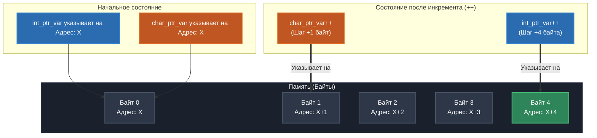

# 🚀 Демонстрация адресной арифметики в языке Си
Интерактивный учебный пример, наглядно иллюстрирующий фундаментальный принцип работы с указателями разного типа (`int*` и `char*`) и логику изменения адресов памяти при инкременте.

---

## 📊 Наглядная схема: Как работает инкремент

Схема показывает, как изменяются адреса указателей после выполнения операции `++`. Указатель на `int` перешагивает сразу через **4 байта**, в то время как указатель на `char` смещается ровно на **1 байт**.



---

## 💻 Исходный код с Doxygen-документацией

Ниже представлен код программы, снабженный подробными комментариями в стиле Javadoc для автоматической генерации документации через **Doxygen**.

```c
#include <stdio.h>

/**
 * @file main.c
 * @brief Демонстрация работы адресной арифметики и указателей в языке Си.
 *
 * Данный файл содержит учебный пример, иллюстрирующий разницу в поведении
 * указателей различных типов (@c int* и @c char*) при выполнении операции
 * инкремента (перехода к следующему адресу памяти).
 */

/**
 * @brief Точка входа в программу.
 *
 * Функция инициализирует переменные, демонстрирует приведение типов указателей
 * и выводит в консоль адреса памяти до и после применения оператора инкремента.
 * Это позволяет наглядно увидеть шаг адресной арифметики для каждого типа.
 *
 * @param[in] argc Количество аргументов командной строки. Не используется в функции.
 * @param[in] argv Массив строк-аргументов командной строки. Не используется в функции.
 *
 * @note Выражения @c (void)argc и @c (void)argv используются для подавления
 * предупреждений компилятора (compiler warnings) о неиспользуемых переменных.
 *
 * @return Статус завершения программы.
 * @retval 0 Успешное выполнение программы.
 */
int main(int argc, char **argv) {
    /* Подавление предупреждений о неиспользуемых аргументах */
    (void)argc;
    (void)argv;

    /**
     * @name Инициализация данных
     * @{ */
    int var = 1;                     /**< Целочисленная переменная (обычно занимает 4 байта в памяти). */
    int *int_ptr_var = NULL;         /**< Указатель на тип int. Инициализирован безопасным значением NULL. */
    char *char_ptr_var = NULL;       /**< Указатель на тип char. Инициализирован безопасным значением NULL. */
    /** @} */

    /**
     * @name Настройка указателей
     * @{ */
    int_ptr_var = &var;              /**< Присвоение указателю адреса переменной @p var. */
    char_ptr_var = (char*)&var;      /**< Явное приведение типа адреса @p var к указателю на @c char. */
    /** @} */

    /* Вывод начального состояния указателей */
    printf("\nBefore arithmetic: int_ptr_var: %u, char_ptr_var: %u\n",
           (unsigned int)int_ptr_var,
           (unsigned int)char_ptr_var);

    /**
     * @name Адресная арифметика
     * @{ */

    /**
     * @brief Инкремент указателя на int.
     *
     * Размер шага зависит от архитектуры и компилятора. На 32/64-битных системах
     * размер @c sizeof(int) равен 4 байтам. Адрес увеличится на 4.
     */
    int_ptr_var++;

    /**
     * @brief Инкремент указателя на char.
     *
     * Размер шага гарантированно равен 1 байту, так как по стандарту Си
     * размер @c sizeof(char) всегда равен 1. Адрес увеличится на 1.
     */
    char_ptr_var++;
    /** @} */

    /* Вывод конечного состояния указателей */
    printf("After arithmetic: int_ptr_var: %u, char_ptr_var: %u\n\n",
           (unsigned int)int_ptr_var,
           (unsigned int)char_ptr_var);

    return 0;
}
```

---

## ⚙️ Анатомия кода: Ключевые моменты

| Элемент кода | Что делает | Зачем это нужно? |
| :--- | :--- | :--- |
| `(void)argc;` | Глушит неиспользуемую переменную | Защищает от предупреждений компилятора при сборке с флагами типа `-Wall`. |
| `(char*)&var` | Явное приведение типов | Позволяет «разобрать» многобайтовую переменную `int` на отдельные байты через `char*`. |
| `ptr++` | Выполняет адресную арифметику | Автоматически сдвигает указатель на размер того типа, на который он ссылается. |

### 🔥 Математическое правило инкремента
Когда вы вызываете `ptr++` для любого указателя в Си, итоговый физический адрес рассчитывается по формуле:

$$\text{Новый адрес} = \text{Текущий адрес} + (1 \times \text{sizeof}(\text{тип указателя}))$$

* **Для `int*`** (при условии, что `sizeof(int) == 4`): если адрес был `1000`, он станет `1004`.
* **Для `char*`** (стандарт гарантирует `sizeof(char) == 1`): если адрес был `1000`, он станет `1001`.

---

## 🛠️ Запуск и компиляция

Вы можете скомпилировать данный пример любым современным компилятором (GCC, Clang, MSVC).

```bash
# Компиляция с выводом всех предупреждений
gcc main.c -Wall -Wextra -o pointer_demo

# Запуск программы
./pointer_demo
```

> ⚠️ **Важное замечание по архитектуре:** В коде используется спецификатор `%u` для вывода адресов. На современных 64-битных системах указатели занимают 8 байт, поэтому приведение к `(unsigned int)` (4 байта) может обрезать верхнюю часть адреса. Для промышленного кода всегда используйте спецификатор `%p`.
---
> ### 💻 Terminal Output
> ``` ⏮️ Сombined Output
> [user@localhost demo]\$ gcc main.c -o pointer_demo && ./pointer_demo
>
> Before arithmetic: int_ptr_var: 2684350400, char_ptr_var: 2684350400
> After arithmetic:  int_ptr_var: 2684350404, char_ptr_var: 2684350401
> ```

### 🔍 Анализ выведенных данных:
1. **До арифметики:** оба указателя смотрят на один и тот же адрес в памяти (`2684350400`), так как они оба изначально были направлены на переменную `var`.
2. **После арифметики (`int_ptr_var++`):** адрес увеличился ровно на **4** единицы (`...404`), подтверждая, что размер типа `int` в данной системе равен 4 байтам.
3. **После арифметики (`char_ptr_var++`):** адрес увеличился ровно на **1** единицу (`...401`), так как размер типа `char` всегда равен 1 байту.
---

## 🛠️ Автоматическая сборка проекта

В корень проекта добавлен `Makefile`. Для управления сборкой и отладкой используйте следующие команды в терминале:

* `make` — компилирует программу с флагами отладки и игнорированием варнинга приведения типов.
* `make check` — автоматически собирает проект и запускает его под контролем утилиты **Valgrind** для поиска утечек памяти.
* `make clean` — удаляет все скомпилированные файлы, очищая рабочую директорию.
---
[← Назад](https://github.com/kolesnikovvitaliy/LERNING_C/tree/main/EXTREME_C/Основные_возможноти_языка/Указатели_на_переменные/exemple)
---
