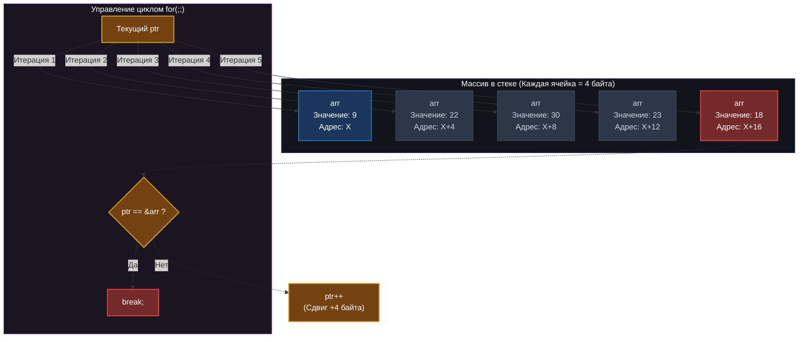

# 🔄 Итерация массива арифметикой указателей (Pointer Arithmetic)


Продвинутый учебный пример, иллюстрирующий концепцию последовательного обхода статического массива в бесконечном цикле `for(;;)` с помощью прямого сдвига указателя (`ptr++`) и проверки условия выхода по точному физическому адресу последнего элемента.

---

## 📌 Оглавление
- [📊 Визуализация: Движение указателя по памяти](#-визуализация-движение-указателя-по-памяти)
- [💻 Документированный исходный код (Doxygen)](#-документированный-исходный-код-doxygen)
- [⚙️ Глубокий анализ механики сдвига адресов](#️-глубокий-анализ-механики-сдвига-адресов)
- [🖥️ Ожидаемый вывод в терминале](#️-ожидаемый-вывод-в-терминале)
- [🛠️ Компиляция и запуск](#️-компиляция-и-запуск)

---

## 📊 Визуализация: Движение указателя по памяти

В отличие от обычной индексации, данный метод перемещает сам рабочий указатель `ptr` вперед по адресам памяти. Шаг каждого инкремента `ptr++` строго равен размеру типа данных (для `int` это 4 байта).



---

## 💻 Документированный исходный код (Doxygen)

Ниже представлен код программы, снабженный комментариями в стиле Javadoc для автоматической генерации технической документации через **Doxygen**.

```c
#include <stdio.h>

/**
 * @file main.c
 * @brief Демонстрация итерации по массиву с использованием арифметики указателей.
 *
 * Данный файл содержит учебный пример, иллюстрирующий концепцию последовательного
 * обхода статического массива в бесконечном цикле @c for(;;) сдвигом указателя
 * (`ptr++`) и проверкой условия выхода по адресу последнего элемента.
 */

/**
 * @def SIZE
 * @brief Фиксированный размер демонстрационного массива.
 * @details Определяет количество элементов типа @c int, выделяемых в стеке.
 */
#define SIZE    5

/**
 * @brief Точка входа в программу.
 *
 * Функция инициализирует массив, настраивает рабочий указатель на его начало,
 * осуществляет пошаговый вывод данных за счет инкремента указателя и безопасно
 * останавливает цикл при достижении финального адреса.
 *
 * @param[in] argc Количество аргументов командной строки (не используется).
 * @param[in] argv Массив строк-аргументов командной строки (не используется).
 *
 * @return Статус завершения программы.
 * @retval 0 Успешное выполнение программы.
 */
int main(int argc, char **argv)
{
    /* Подавление предупреждений компилятора о неиспользуемых аргументах */
    (void)argc;
    (void)argv;

    /**
     * @brief Статический локальный массив целых чисел.
     * @details Выделяет непрерывный участок памяти в стеке размером @c SIZE * sizeof(int).
     */
    int arr[SIZE];

    /**
     * @name Инициализация массива данными
     * @{ */
    arr[0] = 9;   /**< Присвоение значения первому элементу. */
    arr[1] = 22;  /**< Присвоение значения второму элементу. */
    arr[2] = 30;  /**< Присвоение значения третьему элементу. */
    arr[3] = 23;  /**< Присвоение значения четвертому элементу. */
    arr[4] = 18;  /**< Присвоение значения пятому элементу. */
    /** @} */

    /**
     * @brief Рабочий указатель на элементы массива.
     * @details Инициализируется адресом начального элемента массива (`&arr[0]`).
     * В ходе работы цикла этот адрес будет математически изменяться.
     */
    int* ptr = &arr[0];

    /**
     * @brief Бесконечный цикл обхода памяти.
     * @details Вместо стандартного счетчика `for(int i...)` логика шага
     * и выхода из цикла завязана исключительно на адреса памяти указателя @p ptr.
     */
    for(;;) {
        /* Разыменование указателя: вывод значения, лежащего по текущему адресу */
        printf("%d\n", *ptr);

        /**
         * @brief Проверка достижения границы массива.
         * @details Сравнение текущего адреса в @p ptr с вычисленным адресом
         * последнего элемента массива `&arr[SIZE - 1]`.
         */
        if (ptr == &arr[SIZE - 1]) {
            break; /* Безопасный выход из бесконечного цикла */
        }

        /**
         * @brief Арифметика указателей (Инкремент).
         * @details Физический адрес в @p ptr увеличивается на величину `1 * sizeof(int)`.
         * На 32/64-битных системах это сдвиг ровно на 4 байта к следующей ячейке.
         */
        ptr++;
    }

    return 0;
}
```

---

## ⚙️ Глубокий анализ механики сдвига адресов

### 🧠 1. Физика операции инкремента `ptr++`
Когда вы вызываете `ptr++` для указателя типа `int*`, компилятор рассчитывает новый физический адрес по строгому правилу:

$$\text{Новый адрес} = \text{Текущий адрес} + (1 \times \text{sizeof}(\text{int}))$$

Если начальный элемент `arr[0]` расположен по адресу `0x1000`, то после `ptr++` указатель перепрыгнет сразу на `0x1004`, идеально попадая в начало следующего целого числа.

### 🛡️ 2. Безопасность условия выхода и точки останова
Условие `if (ptr == &arr[SIZE - 1])` является фундаментальным барьером безопасности:
* Выражение `&arr[SIZE - 1]` возвращает точный физический адрес последней валидной ячейки массива (`arr[4]`).
* Цикл сначала выводит на экран значение `18` (для `arr[4]`), затем блок `if` фиксирует равенство текущего адреса с финальным и немедленно вызывает `break`.
* Это предотвращает выполнение команды `ptr++` на последнем шаге, защищая программу от перехода указателя в область «чужой» памяти (**Out of Bounds**).

---

## 🖥️ Ожидаемый вывод в терминале

Программа последовательно разыменовывает указатель на каждой итерации, аккуратно выводя содержимое ячеек:

```shell
\$ gcc main.c -g -O0 -Wall -o ptr_demo && ./ptr_demo
9
22
30
23
18
```

---

## 🛠️ Компиляция и запуск

Вы можете собрать данный пример с помощью любого компилятора, поддерживающего стандарт C99 и выше:

```bash
# Сборка проекта с выводом всех предупреждений компилятора
gcc main.c -Wall -Wextra -g -O0 -o ptr_demo

# Запуск скомпилированного файла
./ptr_demo
```

---
[← Назад](https://github.com/kolesnikovvitaliy/LERNING_C/tree/main/EXTREME_C/Основные_возможноти_языка/Указатели_на_переменные/Арифметические_операции_указателями_на_переменные)
---
