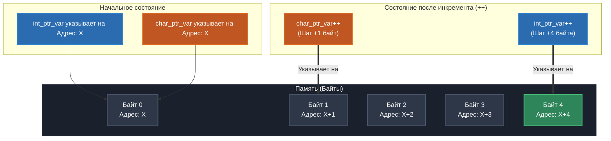

# 🎓 Интерактивный гид: Работа с указателями и памятью в языке Си

Добро пожаловать в учебный модуль, посвященный фундаментальной теме языка Си — **указателям и операции разыменования**. Этот файл создан для того, чтобы наглядно показать, как переменные и указатели взаимодействуют внутри оперативной памяти компьютера.

---
---
[ЛАБОРАТОРНАЯ РАБОТА --> ](https://github.com/kolesnikovvitaliy/LERNING_C/tree/main/EXTREME_C/Основные_возможноти_языка/Указатели_на_переменные/Синтаксис/LAB)
---

## 🚀 Демонстрационный код (`main.c`)

Ниже представлен документированный исходный код программы, которая пошагово инициализирует переменную, связывает с ней указатель и модифицирует значение в памяти.

```c
#include <stdio.h>

/**
 * @brief Демонстрация работы механизма разыменования указателей.
 */
void demonstrate_pointer_dereference(void)
{
    int var = 100;
    int *ptr = NULL;

    printf("--- 1. Начальное состояние ---\n");
    printf("Значение var: %d\n", var);
    printf("Адрес var в памяти (&var): %p\n", (void*)&var);
    printf("Значение ptr до инициализации: %p\n\n", (void*)ptr);

    // Связываем указатель с переменной (записываем адрес var в ptr)
    ptr = &var;

    printf("--- 2. После ptr = &var ---\n");
    printf("Куда указывает ptr (значение ptr): %p\n", (void*)ptr);
    printf("Значение, на которое указывает ptr (*ptr): %d\n\n", *ptr);

    // Меняем значение в памяти через указатель (разыменование)
    *ptr = 200;

    printf("--- 3. После *ptr = 200 ---\n");
    printf("Новое значение var: %d\n", var);
    printf("Значение через *ptr: %d\n", *ptr);
}

int main(int argc, char **argv)
{
    // Подавление предупреждений компилятора о неиспользуемых переменных
    (void)argc;
    (void)argv;

    demonstrate_pointer_dereference();
    return 0;
}
```

---

## 📊 Визуализация процессов в памяти (Схема Mermaid)

Эта интерактивная схема показывает, как меняются состояния указателей `int *ptr` и `char *ptr` при работе с ячейками памяти. Зеленым цветом выделен целевой байт, на который переходит указатель после арифметических операций.



---

## 🛠 Пошаговый разбор логики работы

| Шаг | Операция в коде | Что происходит на уровне железа? |
| :--- | :--- | :--- |
| **1** | `int var = 100;` | В стеке выделяется **4 байта** (для архитектуры x86_64) под число `100`. |
| **2** | `int *ptr = NULL;` | Создается переменная-указатель, которая пока смотрит в «никуда» (`0x0`). |
| **3** | `ptr = &var;` | Оператор `&` берет адрес `var` и записывает его внутрь `ptr`. Теперь `ptr` «знает», где лежит `var`. |
| **4** | `*ptr = 200;` | Оператор разыменования `*` переходит по адресу внутри `ptr` и перезаписывает старые данные на `200`. |

---

## 💻 Пример вывода программы в консоль

При запуске скомпилированного бинарного файла вы увидите следующий лог выполнения:

```text
--- 1. Начальное состояние ---
Значение var: 100
Адрес var в памяти (&var): 0x7ffffe3a45bc
Значение ptr до инициализации: (nil)

--- 2. После ptr = &var ---
Куда указывает ptr (значение ptr): 0x7ffffe3a45bc
Значение, на которое указывает ptr (*ptr): 100

--- 3. После *ptr = 200 ---
Новое значение var: 200
Значение через *ptr: 200
```

> ⚠️ **Важно:** Шестнадцатеричный адрес `0x7ffffe3a45bc` будет меняться при каждом новом запуске программы. Это происходит из-за работы механизма безопасности операционной системы под названием **ASLR** (рандомизация адресного пространства).

---

## 🔧 Компиляция и запуск

Вы можете собрать этот пример на любой Unix-подобной системе (Linux, macOS) или в MinGW на Windows с помощью компилятора `gcc`:

```bash
# 1. Компиляция со строгими флагами проверки качества кода
gcc -Wall -Wextra -std=c99 temp_name.c -o pointer_demo

# 2. Запуск программы
./pointer_demo
```

---
🔒 *Сделано в образовательных целях. Понимание указателей — это первый шаг к управлению системной памятью и написанию оптимизированного кода.*


---
[← Назад](https://github.com/kolesnikovvitaliy/LERNING_C/tree/main/EXTREME_C/Основные_возможноти_языка/Указатели_на_переменные/)
---
