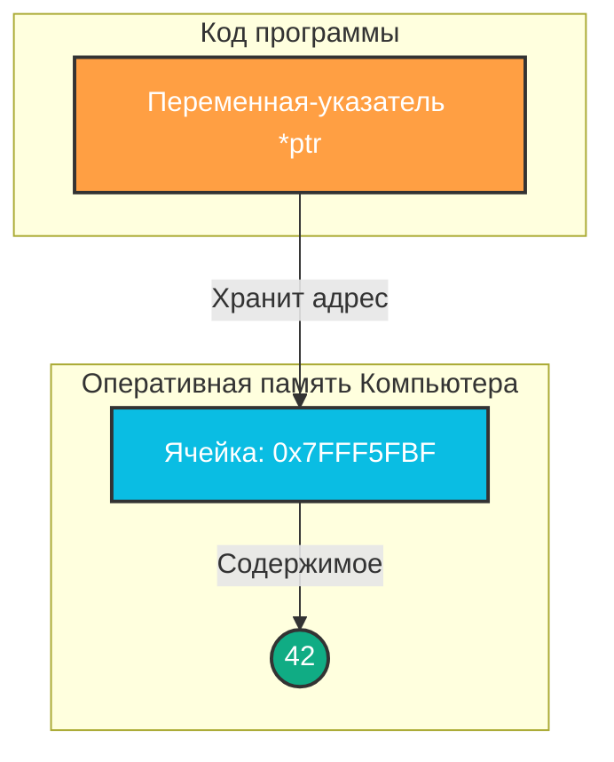
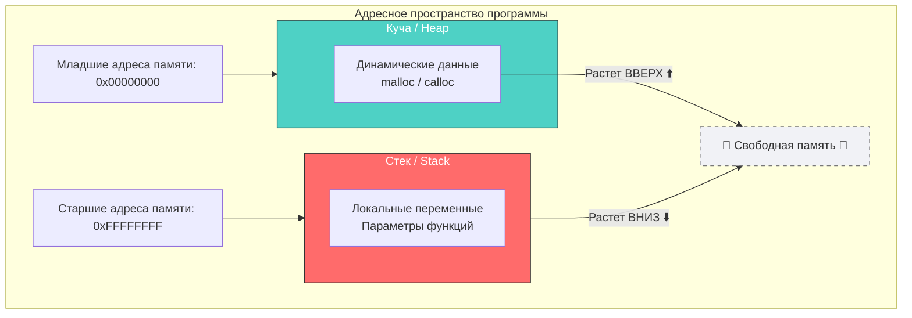

# ⚡ ФУНДАМЕНТ C: УКАЗАТЕЛИ НА ПЕРЕМЕННЫЕ
---

> 📂 **Раздел:** Управление памятью и адресация

> 🚦 **Уровень сложности:** Ключевой концепт (Core)

> 📘 **Связанные главы:** Динамическая память | Структуры данных
---

> [!IMPORTANT]
> **Глубокое понимание указателей того, как они работают,	—** Есть неотъемлемая черта любого квалифицированного программиста на C !
---

## 📌 Что такое указатель?

---
[Лабораторная работа --> ](https://github.com/kolesnikovvitaliy/LERNING_C/tree/main/EXTREME_C/Основные_возможноти_языка/Указатели_на_переменные/Указатели_на_переменные/LAB)
---

**Указатель (Pointer)** — это специальная переменная, которая хранит не само значение (например, число или символ), а **адрес в оперативной памяти**, по которому это значение расположено.

Это одна из самых фундаментальных концепций языка C. В то время как большинство высокоуровневых языков программирования (например, Java, Python, C#) изолируют разработчика от прямого управления памятью, язык C предоставляет полный и прямой доступ к аппаратным ресурсам компьютера.



---

## 🥊 Сравнение: Си-указатели vs Высокоуровневые ссылки

Указатели в C уникальны. Адреса, на которые они указывают, обрабатываются процессором напрямую, без посредников и виртуальных машин.

| Характеристика | 🇨 Указатели (C) | ☕ Ссылки (Java / C#) |
| :--- | :---: | :---: |
| **Прямой доступ к железу (Hardware)** | **Да** 🟢 | Нет 🔴 |
| **Арифметика адресов (сдвиги по памяти)** | **Да** 🟢 | Нет 🔴 |
| **Ручной контроль размещения объектов** | **Да** 🟢 | Нет 🔴 |
| **Автоматическая сборка мусора (Garbage Collection)** | Нет 🔴 | **Да** 🟢 |
| **Риск падения программы при ошибке** | **Критический** 🔥 | Минимальный 🛡️ |

---

## 🧠 Карта памяти процесса: Стек (Stack) vs Куча (Heap)

При запуске программы операционная система выделяет ей виртуальную память, разделенную на сегменты. Указатели работают как со Стеком, так и с Кучей, но эти области ведут себя совершенно по-разному.



### ✨ Краткая шпаргалка по сегментам:
* **Стек (Stack):** Сверхбыстрая память. Выделяется автоматически при вызове функций для локальных переменных. Растет **вниз** навстречу куче. Очищается сама при выходе из функции.
* **Куча (Heap):** Большой пул памяти. Выделяется программистом вручную через `malloc()`. Растет **вверх** навстречу стеку. Требует обязательной ручной очистки через `free()`.

---

## 🏗️ Анатомия синтаксиса в C

Для работы с указателями используются два главных оператора. Их легко запомнить с помощью этой шпаргалки:

```c
int variable = 100;   // Обычное целое число
int *ptr = &variable; // Указатель ptr смотрит на переменную variable
```

| Оператор | Название | Что означает на человеческом языке? |
| :---: | :--- | :--- |
| **`&`** | Оператор взятия адреса | *"Скажи мне, в какой именно ячейке памяти (адресе) лежит эта переменная?"* |
| **`*`** | Оператор разыменования | *"Сходи по этому адресу и покажи/измени то значение, которое там лежит!"* |

### 💻 Живой пример кода

```c
#include <stdio.h>

int main() {
    int age = 25;       // Инициализация переменной на Стеке
    int *p_age = &age;  // Создание указателя на эту переменную

    printf("📋 ИНФОРМАЦИЯ О ПАМЯТИ:\n");
    printf("-----------------------------------------\n");
    printf("🔹 Значение переменной age:      %d\n", age);
    printf("🔹 Адрес переменной age (&age):  %p\n", (void*)&age);
    printf("🔹 Значение внутри p_age:        %p\n", (void*)p_age);
    printf("🔹 Значение, куда смотрит *p_age: %d\n", *p_age);

    return 0;
}
```

---

## ⚠️ Критическая зона: Как делать НЕЛЬЗЯ

Простой синтаксис скрывает колоссальную ответственность. Некорректное использование указателей — главная причина уязвимостей и крашей (Segmentation fault).

Ниже представлены классические примеры кода, которые **никогда нельзя писать**.

### ❌ 1. Разыменование нулевого указателя (Null Pointer Dereference)
Попытка прочитать или записать данные по адресу `NULL` (который указывает на "ничто" или физический адрес `0x0`).

```c
#include <stdio.h>

void bad_code_1() {
    int *ptr = NULL; // Указатель инициализирован ничем

    // 🔥 КАТАСТРОФА! Попытка записать значение по адресу NULL
    *ptr = 10;       // Результат: Мгновенный краш (Segmentation fault)
}
```
👉 **Как исправить:** Всегда проверяйте указатель перед разыменованием: `if (ptr != NULL) { *ptr = 10; }`.
### ❌ 2.Разыменование обобщенного указателя вызывает ошибку компиляции:
```c
#include <stdio.h>
int main(int argc, char** argv)
{
 int var = 9;
 int* ptr = &var;
 void* gptr = ptr;

 printf("%d\n", *gptr);

 return 0;
}
```
### ❌ 3. Использование "диких" указателей (Wild Pointers)
Указатель, который был объявлен, но не инициализирован никаким адресом. Он содержит случайный "мусор" из памяти.

```c
void bad_code_2() {
    int *ptr; // Забыли приравнять к адресу переменной или к NULL

    // 🔥 ОПАСНОСТЬ! Мы не знаем, куда он смотрит.
    // Мы можем случайно перезаписать важные системные данные приложения.
    *ptr = 999;
}
```
👉 **Как исправить:** Всегда инициализируйте указатели при создании: `int *ptr = NULL;`.
---
> [!WARNING]
> **Частая ошибка: Преобразование указателя в `int` разного размера**
> При попытке вывести адрес как `(unsigned int)ptr` на 64-битных системах возникнет ошибка `[-Wpointer-to-int-cast]`. Указатель занимает 8 байт, а `int` — только 4 байта.
>
> **Как делать правильно:**
> ```c
> // Вывод через специальный спецификатор %p
> printf("Адрес памяти: %p\n", (void*)ptr);
> ```
---
### ❌ 3. Возврат указателя на локальную переменную стека
Когда функция завершает работу, её кадр на стеке уничтожается. Указатель на локальную переменную становится "висячим" (Dangling Pointer).

```c
int* get_dangling_pointer() {
    int local_num = 42; // Живет на стеке только пока работает функция
    return &local_num;  // 🔥 ОШИБКА! Переменная сотрется сразу после return
}

void bad_code_3() {
    int *bad_ptr = get_dangling_pointer();
    // Память уже освобождена, там лежит мусор, но мы пытаемся её прочесть
    printf("%d", *bad_ptr);
}
```
👉 **Как исправить:** Для возврата адресов из функций выделяйте память в Куче (Heap) с помощью `malloc()`.

---

## 🛠️ Отладка указателей: Охота на баги с Valgrind

Некоторые ошибки с указателями не вызывают мгновенный краш, а незаметно портят данные. **Valgrind (Memcheck)** — самый мощный инструмент для обнаружения утечек памяти и невалидных чтений/записей.

### 📋 Пошаговый алгоритм проверки кода:

#### Шаг 1: Компиляция с флагами отладки
Скомпилируйте вашу программу с помощью `gcc`, обязательно добавив флаг `-g`. Это позволит Valgrind показывать точные номера строк, где затаилась ошибка.
```bash
gcc -g main.c -o my_program
```

#### Шаг 2: Запуск программы под контролем Valgrind
Запустите утилиту Memcheck следующей командой:
```bash
valgrind --leak-check=full --track-origins=yes ./my_program
```
* `--leak-check=full`: детально покажет все потерянные блоки памяти, которые забыли очистить.
* `--track-origins=yes`: отследит корни появления неинициализированных значений.

### 🔍 Как читать отчет об ошибках (Пример вывода):

Если в коде была допущена ошибка чтения неинициализированных данных или работы с диким указателем, Valgrind выведет в терминал предупреждение:

```text
==12345== Invalid read of size 4
==12345==    at 0x4005F4: bad_code_3 (main.c:28)
==12345==    by 0x400612: main (main.c:34)
==12345==  Address 0xfff00032c is on thread 1's stack
```
💡 **Разбор лога:**
* `Invalid read of size 4` — программа пытается прочесть 4 байта (размер типа `int`) по невалидному адресу.
* `at 0x4005F4: bad_code_3 (main.c:28)` — виновник обнаружен! Ошибка находится прямо в файле `main.c` на **строке 28**.

---

## 🧠 Интерактивный Квиз (Проверь себя)

<details>
<summary><b>❓ Вопрос: Что произойдет, если изменить значение через <code>*ptr</code>?</b></summary>
<br>

Если вы напишете `*ptr = 50;`, то значение исходной переменной, на которую указывал `ptr`, также изменится на `50`. Это происходит потому, что вы изменили данные напрямую в ячейке памяти.
</details>

<details>
<summary><b>❓ Вопрос: Где изучить продвинутое управление памятью?</b></summary>
<br>

Подробные концепции выделения памяти в куче (`malloc`, `calloc`, `free`) и детальный разбор жизненного цикла переменных рассматриваются далее в **Главе 4** и **Главе 5**.
</details>

---
⚡ *Документация подготовлена для быстрого погружения в системное программирование.*
---
---
[← Назад](https://github.com/kolesnikovvitaliy/LERNING_C/tree/main/EXTREME_C/Основные_возможноти_языка/Указатели_на_переменные/)
---
