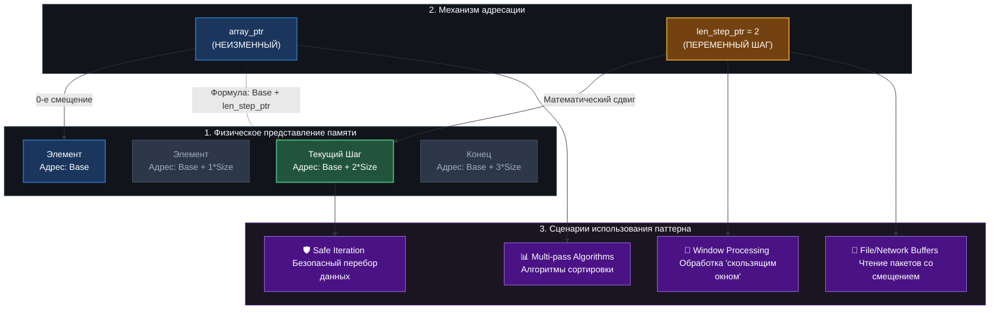

d# 🗺️ Практическое руководство: Паттерн `len_step_ptr` в Си

Применение переменной шага/длины `len_step_ptr` в сочетании со стационарным указателем — это фундаментальный паттерн безопасного программирования на языке Си. Данное руководство описывает, как отказаться от опасной арифметики указателей (`ptr++`) в пользу контролируемого смещения.

---

## 📌 Оглавление

- 📊 Архитектура и визуализация памяти
- [📊 Изучение длины шага указателя по различным типам данных](https://github.com/kolesnikovvitaliy/LERNING_C/tree/main/EXTREME_C/Основные_возможноти_языка/Указатели_на_переменные/Указатели_на_переменные/exemple/len_step_ptr)
- [🧠 Концепция перебора массива без арифметики указателей](https://github.com/kolesnikovvitaliy/LERNING_C/tree/main/EXTREME_C/Основные_возможноти_языка/Указатели_на_переменные/Указатели_на_переменные/exemple/Перебор_элементов_массива_без_арифметики_указателей)
- [🧠 Перебор_элементов_массива_с_помощью_арифметики_указателей](https://github.com/kolesnikovvitaliy/LERNING_C/tree/main/EXTREME_C/Основные_возможноти_языка/Указатели_на_переменные/Указатели_на_переменные/exemple/Перебор_элементов_массива_с_помощью_арифметики_указателей)
- 📝 Список практических примеров использования
  - 1. Работа с динамической памятью (`malloc` и `free`)
  - 2. Многопроходная обработка (Сортировка массива)
  - 3. Скользящее окно (Фильтрация сигналов)
  - 4. Побайтовый парсинг сетевых пакетов
- ⚙️ Математика смещений и сравнение подходов
- 🖥️ Эмуляция вывода в терминале

---

## 📊 Архитектура и визуализация памяти

Схема ниже иллюстрирует, как статический базовый указатель (`array_ptr`) взаимодействует с переменным шагом `len_step_ptr` в памяти, обеспечивая доступ к элементам без изменения самого адреса начала.



---

## 🧠 Концепция перебора массива без арифметики указателей

Классический подход в Си часто использует инкремент самого указателя (`ptr++`), чтобы перемещаться по элементам. Однако, если программист забудет вернуть указатель на начальную позицию, это приведет к потере контроля над памятью.

Использование `len_step_ptr` (индексации через неизменяемый указатель) позволяет вычислять адрес каждого элемента «на лету» с помощью безопасной формулы смещения, оставляя исходную базовую точку нетронутой.

---

## 📝 Список практических примеров использования `len_step_ptr`

### 1. Работа с динамической памятью (`malloc` и `free`)
Если инкрементировать сам указатель (`dynamic_arr++`), адрес начала выделенного блока будет безвозвратно утерян. Вызов `free(dynamic_arr)` в конце программы завершится аварийно (`Segmentation Fault`).

```c
int *dynamic_arr = (int*)malloc(4 * sizeof(int));
int * const array_ptr = dynamic_arr; // Константный указатель защищает адрес

for (size_t len_step_ptr = 0; len_step_ptr < 4; len_step_ptr++) {
    array_ptr[len_step_ptr] = (int)(len_step_ptr * 10);
}

// Указатель не сдвинулся, free() отработает корректно и без утечек!
free(array_ptr);
```

### 2. Многопроходная обработка (Сортировка массива)
В алгоритмах сортировки (например, Bubble Sort) требуется многократно возвращаться к началу массива. Паттерн `len_step_ptr` избавляет от необходимости постоянно сбрасывать указатель в исходное состояние.

```c
// Пример одного прохода сортировки пузырьком
for (size_t len_step_ptr = 0; len_step_ptr < size - 1; len_step_ptr++) {
    // Сравнение соседних элементов без изменения базового адреса
    if (array_ptr[len_step_ptr] > array_ptr[len_step_ptr + 1]) {
        int temp = array_ptr[len_step_ptr];
        array_ptr[len_step_ptr] = array_ptr[len_step_ptr + 1];
        array_ptr[len_step_ptr + 1] = temp;
    }
}
```

### 3. Скользящее окно (Фильтрация сигналов)
При цифровой обработке сигналов часто требуется вычислить среднее значение между текущим элементом и его «соседями». Через шаг `len_step_ptr` это реализуется наглядно и лаконично.

```c
// Скользящее окно шириной 3 элемента (левый, текущий, правый)
for (size_t len_step_ptr = 1; len_step_ptr < size - 1; len_step_ptr++) {
    int smoothed_value = (array_ptr[len_step_ptr - 1] +
                          array_ptr[len_step_ptr]     +
                          array_ptr[len_step_ptr + 1]) / 3;
}
```

### 4. Побайтовый парсинг сетевых пакетов
При чтении данных из сырого буфера байт `len_step_ptr` выступает в роли жесткого смещения, гарантирующего, что мы читаем конкретные поля заголовка пакета относительно его начала.

```c
char *packet_ptr = network_buffer;
// len_step_ptr используется для безопасного прыжка к полезной нагрузке
size_t len_step_ptr = PAYLOAD_OFFSET;

char data_type = packet_ptr[len_step_ptr]; // Чтение типа данных
```

---

## ⚙️ Математика смещений и сравнение подходов

Когда компилятор видит выражение `array_ptr[len_step_ptr]`, он автоматически трансформирует его по следующему математическому правилу:

$$\text{Адрес Цели} = \texttt{array\\_ptr} + (\texttt{len\\_step\\_ptr} \times \texttt{sizeof}(*\texttt{array\\_ptr}))$$

| Критерий | Подход с `len_step_ptr` (`ptr[step]`) | Устаревший подход (`ptr++`) |
| :--- | :--- | :--- |
| **Управление памятью** | 🟢 **Безопасно**. Начальный адрес всегда сохранен для `free()`. | 🔴 **Опасно**. Указатель легко «уплывает» за границы памяти. |
| **Чтение кода** | 🟢 **Высокое**. Математика смещений понятна с первого взгляда. | 🔴 **Низкое**. Требуется постоянно высчитывать текущую позицию в уме. |
| **Аппаратная оптимизация** | 🟢 **Максимальная**. Процессор вычисляет адреса через инструкции `base + index * scale`. | 🟡 **Базовая**. Требуются последовательные операции перезаписи регистра адреса. |

---

## 🖥️ Эмуляция вывода в терминале

При сборке и выполнении кода, использующего данный паттерн, вы получите строго детерминированный шаг адресов (ровно по 4 байта на каждый `int`):

```shell
\$ gcc main.c -Wall -Wextra -o step_demo && ./step_demo

💡 Базовый адрес начала массива (array_ptr): 0x7ffd5f7aa310

| Итерация (len_step_ptr) | Индекс элемента | Значение | Рассчитанный адрес |
|-------------------------|-----------------|----------|--------------------|
| Шаг №1                 | [0]             | 10       | 0x7ffd5f7aa310     |
| Шаг №2                 | [1]             | 20       | 0x7ffd5f7aa314     |
| Шаг №3                 | [2]             | 30       | 0x7ffd5f7aa318     |
| Шаг №4                 | [3]             | 40       | 0x7ffd5f7aa31c     |

✅ Проверка безопасности: array_ptr по-прежнему указывает на: 0x7ffd5f7aa310 (Значение: 10)
```
---
[← Назад](https://github.com/kolesnikovvitaliy/LERNING_C/tree/main/EXTREME_C/Основные_возможноти_языка/Указатели_на_переменные/Указатели_на_переменные)
---
